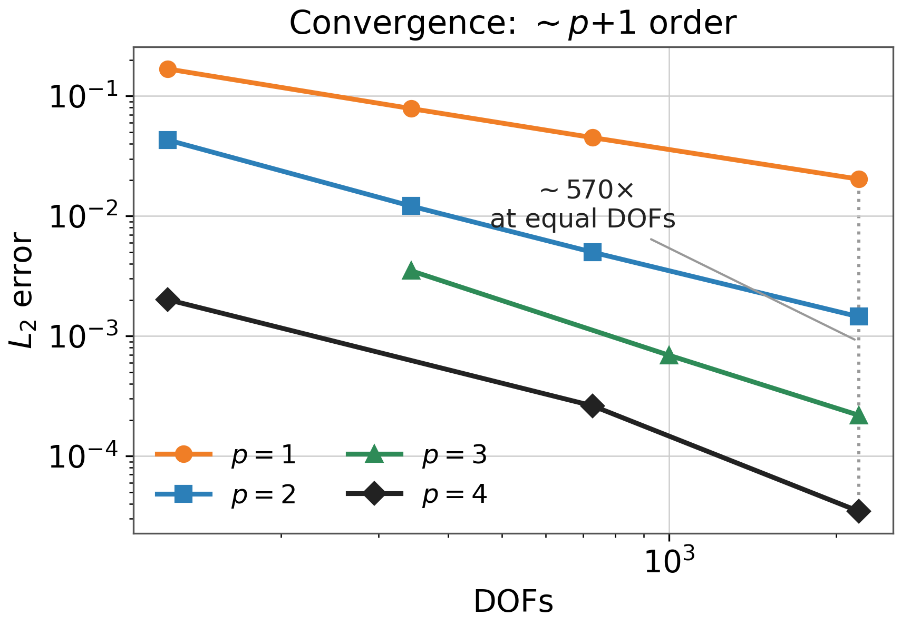
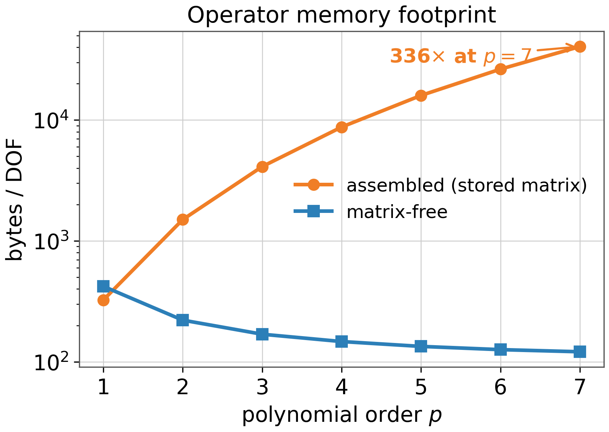
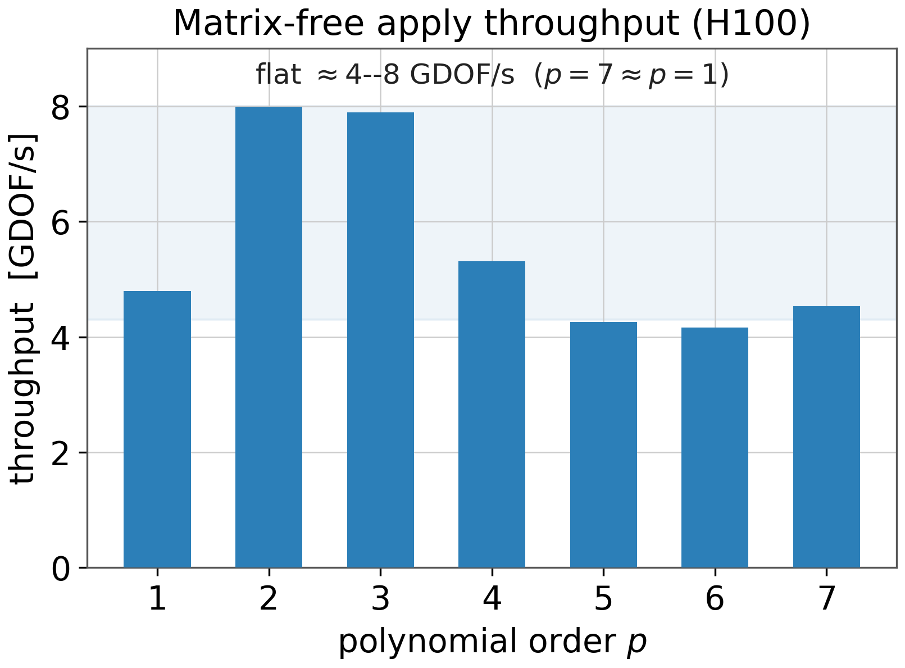
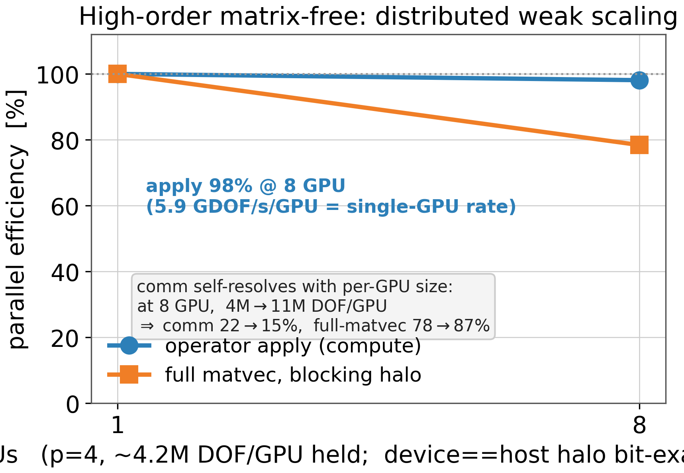
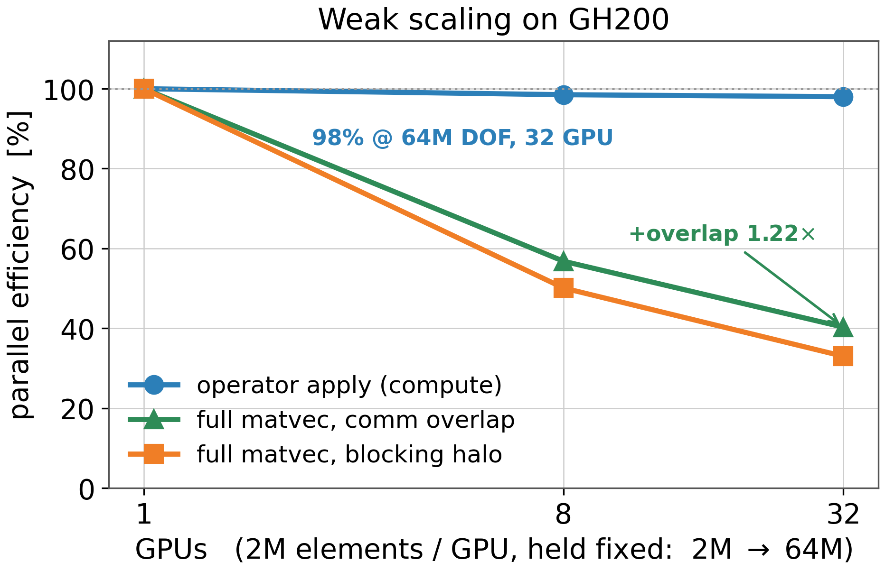
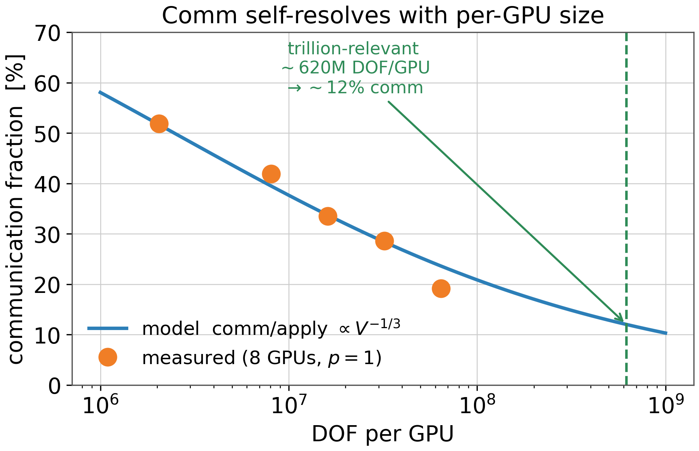
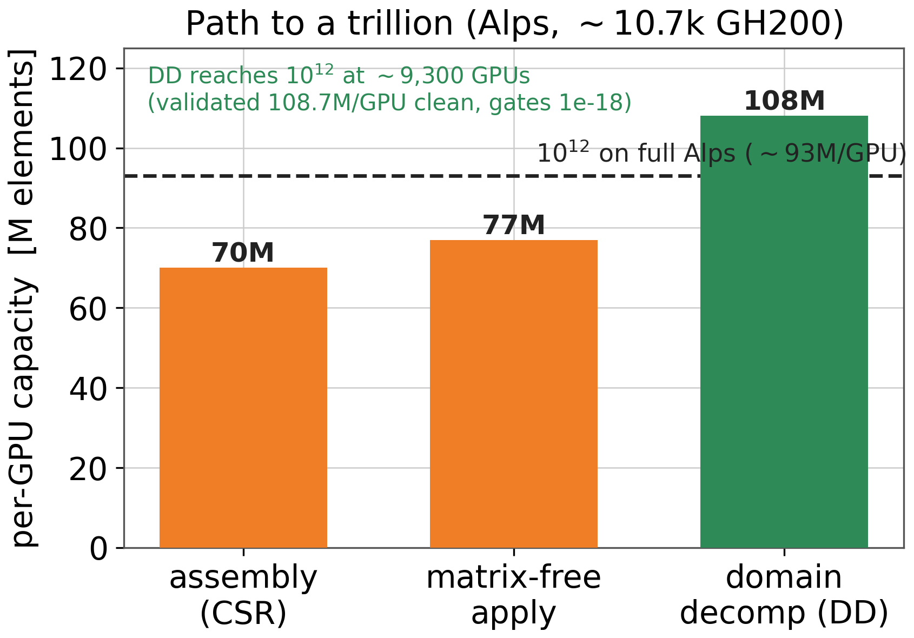

# Distributed High-Order Matrix-Free CVFEM in MARS — A Tutorial

## Who this is for

You are an HPC or scientific-computing engineer who knows some C++ and a little about
finite elements, and you want to understand — from the ground up — how MARS computes the
single most important operation in any PDE solver, `y = A·x`, *without ever storing the
matrix*, at high polynomial order, on thousands of GPUs. The operator throughout is one scalar
field's **CVFEM diffusion Laplacian** — the canonical high-order benchmark PDE. We start from
"what is a matvec" and end at a *measured* bit-exact trillion-degree-of-freedom matvec, with an
honest accounting of where its throughput sits versus the Galerkin matrix-free field. No prior
knowledge of high-order methods, space-filling curves, or GPU halos is assumed; we build each
idea before we use it.

## Learning path

The tutorial climbs in difficulty. Each chapter assumes the one before it.

1. **Why** — the problem (PDEs → a giant `A·x`) and the payoff (high order + matrix-free).
   Pure intuition and the headline numbers. *Beginner.*
2. **The matrix-free operator on a single GPU** — what a matvec really is, sum-factorization,
   the GPU kernel, and how we prove it correct. *Beginner → intermediate.*
3. **Distributed DOF numbering** — naming a degree of freedom the same way on every rank,
   and deciding who owns it. The canonical key and a teachable ownership bug. *Intermediate.*
4. **The distributed matvec and the halo** — the `forward → apply → reverse-add` sandwich,
   receiver-driven exchange, GPUDirect, and the `A·1 = 0` oracle. *Intermediate → advanced.*
5. **Scaling to billions** — weak scaling, why communication self-resolves, the real memory
   wall, and a GPU-native rewrite of the host bottleneck. *Advanced.*
6. **The trillion frontier (honest)** — the arithmetic that fits, the crash we hit, the expert
   lesson in *not* widening an integer, the *measured* bit-exact trillion matvec, the honest
   throughput verdict vs the Galerkin/MFEM field, and what is genuinely not done yet (the solve).
   *Expert.*

A glossary and a "try it yourself" section with real run commands follow the chapters.

---

## Chapter 1 — Why: the problem and the payoff

### The one-paragraph picture of FEM/CVFEM

Almost every simulation in engineering — how heat spreads through a turbine blade, how air
flows over a wing, how a pump pushes fluid — is a *partial differential equation* (PDE) we
cannot solve with pen and paper. The **finite element method (FEM)** turns that continuous
problem into a giant system of linear equations by chopping the domain into small pieces
("elements" — tetrahedra, hexahedra) and approximating the unknown field (temperature,
velocity, pressure) by simple polynomials inside each piece. **CVFEM** (control-volume FEM)
is a close cousin tuned for fluid flow: it enforces conservation (mass, momentum) on small
control volumes built around each node, which is exactly what you want when you must not
lose or invent mass. The end product is always the same shape: a huge matrix `A` and a
vector, and the bulk of the compute is doing `y = A·x` over and over inside a linear solver.

So the whole game reduces to one question: **how do we apply `A` to a vector, fast, for an
`A` so big it spans thousands of GPUs?**

One thing to be precise about from the start, because it sets the scope of every claim that
follows. The operator this tutorial builds is the **CVFEM diffusion Laplacian** — one scalar
field, `−div(grad u)`. It is *not* advection-diffusion (that is the production `cvfem_graph`
operator; the matrix-free path here does only the diffusion half — advection is parked, not
implemented), and it is *not* full Navier-Stokes (that is the pump). It is also not a Galerkin
weak-form operator: CVFEM enforces a *subcontrol-surface flux balance*, not the integral
`∫ grad v · grad u`. The device correctness gate is literally `A·1 = HO-Laplacian.const = 0`.
Keep that one-scalar-diffusion-Laplacian identity in mind — it is the canonical high-order
benchmark PDE and the bottleneck inside an implicit pressure/Poisson solve, but it is a
deliberately scoped operator, not the whole NS stack.

A fair question to ask up front: MARS's own FSI application — the pump — runs at `p=1`, so why
build high-order CVFEM at all? Be honest about it. The pump is complex geometry: walls, corners,
boundary layers, where the formal ~`h^(p+1)` accuracy gain is capped and `p=1` is the pragmatic
choice. High order is not for the pump. It is for the other end of the spectrum — smooth,
resolution-limited, high-Reynolds LES over large domains — where resolving the turbulent field
with far fewer unknowns (low numerical dispersion and dissipation) is exactly what lets a
trillion-DOF run fit on the machine. That regime is why Sandia's Nalu-Wind lineage
([Knaus 2022](#references)) invested in high-order CVFEM in the first place: production CFD needs
the locally conservative control-volume form, not Galerkin, and wind-energy LES needs accuracy
per unknown. So this operator is the scaling capability for the problems where high order pays,
delivered in the conservative discretization those problems require — which is why the lineage
built it and why a trillion-DOF demonstration matters even when today's pump is `p=1`.

### What "high order" (`p`) means

Inside each element, the polynomial has a degree `p`. At `p=1` the field is linear
(flat-faced, like a coarse mosaic); at `p=4` it is a degree-4 polynomial that can curve and
bend within a single element. Higher `p` means each element carries far more degrees of
freedom (DOF) — the numbers we actually solve for. A `p=4` hex holds `(p+1)^3 = 125` DOF
instead of `8`.

Why pay for that? Because accuracy improves much faster than cost. High order gives roughly
**`p+1` order of convergence** — each refinement cuts the error by a steep power. The payoff
is measured directly in MARS: at equal DOF count, going from `p=1` to `p=4` is about **570×
more accurate**. That is the convergence story.

**Code jump — the convergence data behind `fig_convergence`:**
`docs/figures/make_matfree_figs.py`, the `conv` dictionary:
```python
conv = {
    1: ([125, 343, 729, 2197], [1.68e-1, 7.86e-2, 4.50e-2, 2.03e-2], ...),
    4: ([125, 729, 2197],      [2.01e-3, 2.62e-4, 3.47e-5],          ...),
}
```
Notice: read the *last column* of each row — at ~2197 DOF, `p=1` error is `2.0e-2` but `p=4`
is `3.5e-5`. Same number of unknowns, ~570× lower error. High order buys accuracy you cannot
get from just adding more low-order elements.



*L2 error vs DOF, one line per order. The slopes steepen with `p` (≈ `p+1` order). At ~2197
DOF the dotted line shows `p=1` and `p=4` differ by ~570× in error for the same unknown count.*

One thing to be clear about: "equal DOF count" means *different meshes on the same unit cube*. A
`p=1` hex contributes ~1 unknown, a `p=4` hex contributes ~64 (`(p+1)^3` nodes). So matching the
unknown count puts `p=1` on a fine mesh and `p=4` on a coarse one — at the ~2197-DOF point that is
a `12^3 = 1728`-element mesh (`p=1`) versus a `3^3 = 27`-element mesh (`p=4`). The fair question is
"for a fixed number of unknowns, which order resolves the solution better," and high order wins
because the error decays like ~`h^(p+1)`. One caveat: this `h^(p+1)` rate assumes a *smooth*
solution and accurate geometry — on a real mesh with corner singularities, boundary layers,
turbulence, or curved walls approximated by straight-sided hexes, the gain is far smaller than 570×.

### What "matrix-free" means, and why it is the whole point at high order

The obvious way to do `y = A·x` is to *build and store* the matrix `A` first (in CSR/sparse
format), then multiply. That is **assembled**. The problem: at high order, `A` becomes
enormous *per DOF*. A `p=4` element couples all 125 of its DOF to each other, so the stored
matrix balloons.

**Matrix-free** flips this: never store `A`. Instead, recompute `A·x` on the fly, element by
element, straight from the basis polynomials and the element geometry. You trade a little
extra arithmetic for an enormous saving in memory — and memory (HBM bandwidth and capacity)
is the real wall on a GPU.

**Code jump — the memory crossover behind `fig_memory`:**
`docs/figures/make_matfree_figs.py`:
```python
asm_full = [324, 1500, 4116, 8748, 15972, 26364, 40500]   # full CSR ~(2p+1)^3, p=1..7
asm7     = 87.7                                            # assembled CVFEM 7-nnz graph, p=1 ONLY
pa = [277.7, 196.0, 158.0, 138.8, 128.0, 121.0, 116.0]    # matrix-free, store d_G (--PA)
mf = [185.1,  72.0,  40.0,  26.8,  20.5,  17.0,  14.5]    # matrix-free, recompute (--MF)
```
Notice three things. (1) The assembled stored-matrix cost *grows* with `p` (324 → 40500
bytes/DOF) because the coupling explodes like ~`(2p+1)^3`; the matrix-free cost *shrinks* (277
→ 116 for store-`d_G`, 185 → 14.5 for recompute) because you amortize geometry over more DOF.
(2) At `p=1` the *production* assembled operator is not the full CSR — it is the **assembled
CVFEM 7-nnz graph** at **84 B/DOF**, leaner than either matrix-free variant (84 < 185 < 278).
So at `p=1`, assembled wins on memory; matrix-free is the slightly heavier choice. (3) By
`p=7` matrix-free is **~340× leaner** (store-`d_G`) / ~2800× (recompute) than the stored
matrix. High order is exactly where matrix-free pays off — not `p=1`.

Two matrix-free flavours appear here and stay distinct through the whole tutorial. **PA
(partial assembly, `--PA`)** stores the per-element metric `d_G` once and applies it on the
hot path — that is the production operator. **MF (recompute, `--MF`)** stores *nothing* and
rebuilds the geometry on every apply — leaner still in memory but more arithmetic. PA is what
the scaling chapters use; MF is the one-step-further extension noted in §2.4.



*Bytes/DOF vs `p` (log scale). The stored full-CSR matrix climbs 324 → 40500 as coupling
explodes; matrix-free falls (PA 278 → 116, MF 185 → 14.5). The `X` marks the production
assembled CVFEM 7-nnz operator at `p=1` (84 B/DOF) — leaner than matrix-free there. By `p=7`
matrix-free is ~340× (PA) / ~2800× (MF) leaner than the stored matrix.*

There is a second, less obvious win. Done naively, recomputing `A·x` for a `p=4` element
would be a dense `125×125` multiply. **Sum-factorization** restructures it into a sequence of
small 1D operations along each axis, collapsing the per-DOF cost from `O(p⁶)` to `O(p⁴)` — so
throughput peaks in the mid orders (`p=2–3`) instead of falling off a cliff as `p` grows.

**Code jump — the sum-factorized element apply:**
`backend/distributed/unstructured/fem/mars_cvfem_ho_apply.hpp`, inside `applyHoCvfemElement`:
```cpp
for (int q=0;q<n;++q) { bi+=op.Btil[l*n+q]*u[idx(dir,q,s,r)];
                        di+=op.Dtil[l*n+q]*u[idx(dir,q,s,r)]; }
```
Notice: `Btil` (interpolation) and `Dtil` (derivative) are **small 1D operators** (`n × n`,
where `n = p+1`). The kernel sweeps them along one direction at a time (`dir`), not as one big
dense matrix. That 1D-at-a-time structure is *why* the cost doesn't blow up with `p`.

**Code jump — the measured throughput curve behind `fig_throughput`:**
`docs/figures/make_matfree_figs.py` (single-GPU GH200, store-`d_G` PA, apply-only, saturated at
17M DOF/GPU, `A·1` PASS at every `p`):
```python
# MEASURED, NOT flat: register+warp-shuffle apply, peaks at p=3 (~12 GDOF/s/GPU),
# high band p=2-3, then declines (occupancy cliff at p=4; p>=5 warp-padding waste). PA, store-d_G.
fp64_gd = [5.35, 8.34, 9.73, 5.99, 4.51, 4.47, 4.94, 3.61]  # p=1..8, fp64 metric
fp32_gd = [6.51, 9.74, 9.84, 6.03, 4.54, 4.50, 4.99, 3.64]  # p=1..8, fp32 metric (compute fp64)
```
The curve is **not flat — it peaks at `p=3` (~12 GDOF/s/GPU), holds a high band at `p=2–3`, and
eases to lower rates across `p=4–8`** (the occupancy cliff at `p=4`: 64→125 nodes/element; and
at `p≥5` warp-padding waste when the face rows do not divide 32). Sum-factorization keeps the
*complexity* `O(p⁴)`, not the absolute GDOF/s flat. These are the **register+warp-shuffle** apply
numbers (§2.7): the sum-factorization face contractions are held in registers and exchanged across
threads with `__shfl_sync` instead of through shared-memory face buffers, which drained the
shared-memory pipe (LSU ~99%→~50% at `p=4`) and roughly doubled peak throughput over the earlier
shared-buffer kernel. **At `p=1`, assembled CVFEM wins decisively:** the production 7-nnz graph SpMV runs
**24.7 GDOF/s** — ~4.6× faster than matrix-free PA (5.32) and ~32× faster than recompute MF
(0.78) — and it is also leaner (the memory chart above). So *for `p=1` production, use the
assembled operator, not matrix-free.* Matrix-free's value is the high-order story: it *climbs*
into its `p=2–3` peak while the stored full-CSR SpMV *collapses* as the matrix explodes (`8.74`
at `p=1` toward near-zero), so matrix-free overtakes it around `p=2`. The orange bars are the
**fp32 metric** (compute stays fp64, `A·1` unaffected): it lifts only the bandwidth-bound LOW
orders toward the peak — **+22% at `p=1`, +17% at `p=2`, <1% from `p=3` up** — because at the peak
the kernel is L1-bound, not HBM-bound, so halving the metric width buys ~0. (One honest caveat:
the kernel was shared-memory-*instruction* bound, so FP64 tensor cores did **not** help here — a
measured negative result. The positive follow-up is the register+warp-shuffle apply that produced
these numbers: holding the face contractions in registers and exchanging them with `__shfl_sync`
drained that shared-memory pipe and roughly doubled peak throughput. Chapter 2 owns both.)

> **Per-GPU, not aggregate.** These ~12 GDOF/s (peak `p=3`, register+warp-shuffle) are a *single-GPU, store-`d_G` PA* number. The
> trillion headline of **3.375 TDOF/s** (Ch. 5–6) is *aggregate across 2048 GPU on the recompute
> path* (~1.65 GDOF/s/GPU) — a different path and a different scope. Don't conflate the two.



*Matvec apply throughput per order on a single GH200 (store-`d_G` PA, register+warp-shuffle apply,
per-GPU). Throughput peaks ~12 GDOF/s at `p=3` (high band `p=2–3`), then eases across `p=4–8`
(occupancy cliff at `p=4`; `p≥5` warp-padding waste). The fp32
metric (orange) lifts only the low orders toward the peak; from `p=3` up the kernel is L1-bound
and fp32 buys ~0.*

### When to use which: assembled at `p=1`, matrix-free at high order

Put the two charts together and the decision rule is clean, and it is **not** "matrix-free
everywhere":

- **`p=1` production → assembled CVFEM (7-nnz graph).** It is both faster (24.7 vs 5.3 GDOF/s)
  and leaner (84 vs 278 B/DOF) than matrix-free. The MARS pump runs here. Do *not* reach for
  matrix-free at `p=1` — you would pay more memory for less throughput.
- **`p≥2–3` → matrix-free.** The stored matrix balloons like ~`(2p+1)³` (8,748 B/DOF at `p=4`,
  40,500 at `p=7`) while matrix-free stays ~100–120 B/DOF (PA) — ~340× leaner at `p=7` — and
  matrix-free throughput *peaks* at `p=3` (~12 GDOF/s/GPU, high band `p=2–3`) exactly where the
  stored SpMV collapses. High order is the regime matrix-free was built for.

This is exactly the split the high-order CVFEM lineage already settled on. Knaus
([Knaus 2022](#references)) stores the matrix at low order and goes matrix-free for high order
because the stored operator becomes infeasible; Nalu-Wind's default is the same — assembled at
low order, matrix-free (partial assembly) at high order — on both CPU and GPU. MARS follows
that rule; its one extension beyond Knaus/Nalu is the `--MF` *recompute* path (no stored
metric at all), where they always **store** the metric (partial assembly). The PA-vs-MF
distinction in §2.4 is exactly that extension.

### Where the geometry actually lives

Matrix-free still needs *some* stored data per element: a small per-point metric that encodes
how the reference cube maps to the real, possibly-curved element. This is the one array that
sets the memory ceiling.

**Code jump — the per-element metric:**
`backend/distributed/unstructured/fem/mars_cvfem_ho_apply.hpp`:
```cpp
computeElementMetric(const HoCvfemOperators& op, const double corners[8][3])
```
Notice: the metric is computed once from the 8 corner coordinates and reused for every `A·x`.
For a *general curved mesh* it costs ~7.2 KB/element of HBM — and that single array, not the
arithmetic, is what caps a GPU at **~620M DOF/GPU** at `p=4` (measured).

### The journey ahead

This tutorial walks the same path the MARS operator took: a bit-exact single-GPU CVFEM
diffusion-Laplacian operator (Ch. 2), made distributed without losing a digit (Ch. 3–4), scaled
until communication stops mattering (Ch. 5), and run as a *completed bit-exact matvec* at a full
trillion DOF (Ch. 6). For *scale* context: **MFEM won Gordon Bell 2025** with 55.5 trillion DOF on
43,520 MI300A GPUs (~1.27B DOF/GPU); on Alps that class is ~9.3T DOF on ~9,200 GH200s. The MARS HO
operator's measured trillion matvec (1.005T DOF on 2,048 GH200) sits in the same **~1B DOF/GPU**
density league. Two honest caveats we develop in Chapter 6: the GB2025 result is an *application*
operator (a vector wave), so it is a *density* yardstick, **not** a throughput bar; and on raw
per-GPU apply throughput our CVFEM operator is *comparable-regime* (measured peak ~12 GDOF/s/GPU
at `p=3`, store-`d_G` PA register+warp-shuffle apply), not leading. What is genuinely **not** done is the
distributed *solve* — Chapter 6 is precise about that boundary.

---

## Chapter 2 — The Matrix-Free Operator (Single GPU)

In Chapter 1 we framed the problem. Now we *do* the operation. Almost every iterative solver
— Conjugate Gradient, GMRES, multigrid — needs exactly one thing from the discretized PDE,
over and over again:

> Given a vector `x`, compute `y = A x`.

`A` is the stiffness matrix. For a diffusion (Laplacian) problem, `A x` answers "if the
solution were `x`, what would the residual fluxes be?" The whole game of a fast solver is
making this one operation — the **matvec** — as cheap as possible.

This chapter builds intuition for why a matrix-free matvec is not just possible but *faster*
at high order, walks through the actual GPU kernel, and ends with how we *prove* it is correct
— plus one honest negative result about tensor cores.

### 2.1 What is a matvec, really?

If you have `A` stored as a sparse matrix (CSR: values + column indices), the matvec is a
loop: for each row `i`, `y[i] = sum_j A[i][j] * x[j]`. You read every nonzero of `A` from
memory once per matvec. That is the "assembled" approach.

But where did `A` come from? It came from summing little contributions, one per mesh element.
Element `e` couples its own DOF to each other; the global `A` is just all those element
matrices `K_e` scattered into the right rows and columns and added up.

The matrix-free insight: instead of *storing* the assembled `K_e` and reading them back, we
**recompute the action of `K_e` on the fly**, element by element. The pattern for every
element is:

1. **Gather** — pull this element's slice of `x` out of the global vector (using the
   element-to-DOF map).
2. **Apply** — compute `y_e = K_e x_e` for this one element, *without ever forming `K_e`*.
3. **Scatter** — add `y_e` back into the global `y` at this element's DOF rows.

Do that for all elements and you have computed `y = A x`. Shared DOF on element boundaries get
contributions from several elements — the scatter-add handles that automatically.

Why bother? Two reasons. First, memory: storing `A` at high polynomial order is enormous (we
saw the crossover in Chapter 1). Second, and counterintuitively, the on-the-fly apply can be
made *cheaper* than reading a stored matrix — if we are clever about step 2. That cleverness
is sum-factorization.

### 2.2 The element: a tensor-product box of GLL nodes

We use **high-order** hex elements. Order `p` means each element carries `(p+1)` solution
nodes per direction, arranged on a 3D tensor-product grid: `(p+1)^3` DOF per element. The
nodes are not evenly spaced — they sit at **Gauss-Lobatto-Legendre (GLL)** points, which keeps
high-order interpolation stable.

The key structural fact: because the element is a tensor product, *every operation factors
into 1D operations along each axis*. We never need a dense `(p+1)^3 × (p+1)^3` element matrix.
We only need small 1D operators, built once on the host.

**Code jump — the 1D reference operators.**
`backend/distributed/unstructured/fem/mars_cvfem_ho_basis.hpp`, `struct HoCvfemOperators`:
```cpp
struct HoCvfemOperators {
    int p = 0;
    std::vector<double> zeta;       // (p+1) GLL nodes
    std::vector<double> xi;         // p Gauss points
    std::vector<double> Btil;       // p x (p+1)
    std::vector<double> Dtil;       // p x (p+1)
    std::vector<double> D;          // (p+1)^2 GLL derivative
    std::vector<double> W;          // (p+1)^2 integration
    std::vector<double> Deltatil;   // (p+1) x p
};
```
What to notice:
- These are *tiny* — at most `(p+1)^2`-sized. The whole set is a few KB even at `p=8`. That is
  the entire "operator." There is no element matrix.
- `zeta` are the `(p+1)` GLL solution nodes (the DOF). `xi` are the `p` Gauss quadrature
  points — the subcontrol-surface (SCS) faces where CVFEM evaluates fluxes.
- `Btil` interpolates from GLL nodes to the flux points; `Dtil` takes the derivative there;
  `D` differentiates GLL-to-GLL; `W` integrates a flux over a subcontrol interval.

Precise definitions (`L_j` = the Lagrange basis through the GLL nodes `ζ`):

| operator | size | what it does | formula |
|---|---|---|---|
| `zeta` (ζ) | p+1 | GLL solution nodes = the DOF | — |
| `xi` (ξ) | p | Gauss points = the SCS flux faces | — |
| `Btil` (B̃) | p×(p+1) | interpolate node values → flux points | `B̃[i][j] = L_j(ξ_i)` |
| `Dtil` (D̃) | p×(p+1) | derivative at the flux points | `D̃[i][j] = L_j′(ξ_i)` |
| `D` | (p+1)² | derivative at the nodes themselves | `D[i][j] = L_j′(ζ_i)` |
| `W` | (p+1)² | histopolation: integrate flux back to nodes (Knaus Eq 5–6) | `W = (edge-function matrix)⁻¹` |
| `Deltatil` (Δ̃) | (p+1)×p | ±1 subcontrol-face incidence (Knaus Eq 7) | `Δ̃[i][i] = −1, Δ̃[i][i−1] = +1` |

The `til` (tilde) marks the operators evaluated **at the Gauss flux points** `ξ` (B̃, D̃, Δ̃), versus
`D`/`W` which act at the GLL nodes. All of them are built **once** on the host by
`buildHoCvfemOperators(P)` from `p` alone — pure 1D quadrature/interpolation math, **no element
geometry enters**. They are *not* an element stiffness matrix `K_e`; the matrix-free apply never
forms `K_e`.

This follows Knaus' high-order CVFEM formulation ([Knaus 2022](#references), SAND2022-3366J). At `p=1` it collapses to
ordinary linear CVFEM: `zeta={-1,1}`, `xi={0}`, `Btil=[1/2,1/2]`, `Dtil=[-1/2,1/2]`.

### 2.3 Sum-factorization: why O(p⁴) beats O(p⁶)

Here is the heart of the chapter. Naively, applying a dense element matrix is
`(p+1)^3 × (p+1)^3` work — that is **O(p⁶)** per element. For `p=4` that is `125 × 125 ≈
15,600` multiply-adds per element. It gets brutal fast.

Sum-factorization exploits the tensor structure. A 3D contraction over a tensor-product grid
can be done as **three sequential 1D sweeps**, one per axis. Each sweep is a small 1D matrix
`(p+1)×(p+1)` applied along one direction, across the `(p+1)^2` lines in the other two
directions. That is `(p+1)^2 × (p+1)^2` work per sweep — **O(p⁴)**, done a constant number of
times.

The payoff is dramatic and measurable: because the cost per DOF stops growing like `p²`,
**throughput climbs into a mid-order peak instead of collapsing** — in MARS, the store-`d_G`
register+warp-shuffle apply (per GPU, GH200) **peaks ~12 GDOF/s at `p=3`** (high band `p=2–3`) and
stays in a usable band across `p=4–8` (where a dense apply would be `O(p⁶)` and unusable). You get much higher
accuracy per DOF while throughput stays in a usable band at every order. That is *the* reason to
go high-order matrix-free.

**Code jump — the host reference apply (the ground truth).**
`backend/distributed/unstructured/fem/mars_cvfem_ho_apply.hpp`, `applyHoCvfemElement`. This is
Knaus Alg 2 ([Knaus 2022](#references)): loop over each direction `dir` and each SCS face `l`, and
do the three 1D contractions:
```cpp
for (int dir = 0; dir < 3; ++dir)
    for (int l=0;l<p;++l) {
        // step 1: normal interp(Btil) + deriv(Dtil) along `dir`
        for (int s=0;s<n;++s) for (int r=0;r<n;++r) {
            double bi=0, di=0;
            for (int q=0;q<n;++q) { bi+=op.Btil[l*n+q]*u[idx(dir,q,s,r)];
                                    di+=op.Dtil[l*n+q]*u[idx(dir,q,s,r)]; }
            interp[s*n+r]=bi; deriv[s*n+r]=di;
        }
        // step 2: tangential D-derivatives + flux = metric * grad
        // step 3+4: W-integrate the flux over the face (both tangential axes)
        for (int s=0;s<n;++s) for (int r=0;r<n;++r) {
            y[idx(dir,l,  s,r)] -= intf[s*n+r];   // distribute -/+ to the
            y[idx(dir,l+1,s,r)] += intf[s*n+r];   // two nodes bounding face l
        }
    }
```
What to notice:
- Every inner `q`-loop is length `n=(p+1)` — a 1D contraction. No `O(p⁶)` tensor ever appears.
- `idx(dir,nrm,t1,t2)` re-strides the *same* flat array so "the normal axis" is whichever of
  x/y/z `dir` points at. One array, read three ways.
- The last two lines are the CVFEM finite-volume step: a flux on subcontrol face `l` leaves
  node `l` and enters node `l+1`. That `-/+` pair is the discrete divergence — and it is
  exactly why `A·1 = 0` later (a constant has zero flux, so every face contributes `-c+c=0`).

This host version is deliberately simple and slow. It exists to be the bit-exact reference the
GPU kernel is checked against. One scoping note for honesty: the matrix-free apply is validated
to **bit-parity against the MARS FULL assembled diffusion operator** (the dense 27-nnz CSR),
*not* against the 7-nnz diagonally-lumped production graph. The full-assembled operator is the
right reference because it is the same diffusion bilinear form with no lumping — the matrix-free
path reproduces it digit-for-digit, which is exactly what the `A·1 = 0` and `A·linear = 0` gates
below pin down.

### 2.4 The per-element metric: where the geometry lives

The 1D operators above are defined on the *reference* cube `[-1,1]³`. Real elements are
stretched, sheared, possibly curved. The geometry enters through one object: the **metric**
`G`, computed per element from its 8 corner coordinates via the Jacobian. It is
`detJ · J⁻¹J⁻ᵀ` at each flux point — it tells the apply how a reference-space gradient maps to
a physical-space flux, including cross-axis coupling when the element is not axis-aligned.

**Code jump — the metric.**
`mars_cvfem_ho_apply.hpp`, `computeElementMetric`:
```cpp
// Gvec = metric * e_dir = detJ * (J^{-1}J^{-T})[:,dir]
double gvec[3];
for (int a=0;a<3;++a) { double v=0; for(int k=0;k<3;++k) v+=Ji[a][k]*Ji[dir][k]; gvec[a]=det*v; }
auto& g = G[((size_t)(dir*p + l)*n + s)*n + r];
g[2]=gvec[dir]; g[1]=gvec[t1axis[dir]]; g[0]=gvec[t2axis[dir]];
```
What to notice:
- `g[2]` is the **normal** coefficient, `g[0]`/`g[1]` are the two **tangential** (cross-term)
  coefficients. On an orthogonal cube the cross terms are zero and only `g[2]` survives — the
  "Affine" fast path.
- This metric is computed **once** and reused across every matvec. The apply kernel never
  touches geometry again — it just reads `G`. The apply is on the solver's hot path; the
  metric build is not.
- The flip side, and the reason for our per-GPU memory ceiling: `G` is `3·p·(p+1)²` vec3s per
  element of HBM (~7.2 KB/elem at `p=4`). That array is what caps us at ~620M DOF/GPU at
  `p=4`.

**This pattern has a name: partial assembly.** Store the geometric metric per quadrature point,
then apply the operator via sum-factorization at solve time — never assemble a global sparse
matrix and never recompute geometry on the hot path. It is structurally the same data-flow MFEM
uses (store only the per-point data `D`, evaluate the basis/gather operators on the fly under the
tensor-product structure — [MFEM partial assembly](#references)), and the same data-flow the 2025
Gordon Bell winner used for its 3D wave forward operator. The lineage is direct: our `d_G` is
byte-for-byte Knaus's per-element metric `G` (`N_el × 3p(p+1)² × 3`), and Knaus's high-order
CVFEM scheme ([Knaus 2022](#references), SAND2022-3366J) is itself partial assembly — it stores
`vol`, `m_dot`, `A`, `G` per element, `O(p³)` total, and calls it a "memory-efficient scheme."

But be precise about *what* is shared, because it is easy to overstate. The shared thing is the
**partial-assembly storage strategy and sum-factorized apply**, not the operator. MFEM's
partial-assembly benchmarks (BP3/BP5) discretize the **Galerkin** Laplacian `∫ grad v · grad u`;
MARS discretizes the **CVFEM** subcontrol-volume flux balance. These are *different operators*
that happen to share the same PA machinery. So the right statement is: **same method class
(partial assembly + sum-factorization), different discretization** — and that difference has real
throughput consequences (§2.7, Ch. 6), because CVFEM moves more geometry per DOF and does more
FLOP/DOF than the leaner Galerkin BP collocation. (One more precision: "matrix-free" in all three
means *no assembled global matrix* — both Knaus and MARS keep the metric **persistently in DRAM**.
Knaus's "registers" is only the in-kernel working slice of one element for `p≤4`, not a separate
storage tier. The truly recompute-everything matrix-free variant stores nothing and pays the
FLOPs back on every apply; in MFEM's own benchmarks that variant *lost* on wall-clock to partial
assembly. MARS's contribution over Knaus is carrying this CVFEM PA operator to *distributed*,
all-order (`p≤7`), trillion-DOF scale.)

### 2.5 The GPU kernel: gather / apply / scatter, one thread per face slot (registers + warp shuffles)

Now the device twin. The design constraint is *not* compute — sum-factorization made the
arithmetic cheap. The constraint is **shared-memory bandwidth and occupancy**. The kernel in
`mars_cvfem_ho_matfree.hpp` is built around three decisions:

1. The tiny reference operators (`Btil`, `Dtil`, `D`, `W`) live in **`__constant__` memory**,
   not shared. They are read-only, identical for every element, and the constant cache
   broadcasts one value to a whole warp in a single transaction — at zero shared-memory cost.
   This is the single biggest occupancy win.
2. **One thread per tangential `(s,r)` face slot.** That thread owns its entire normal column,
   so the normal-direction contraction and the `-/+` scatter to nodes `l, l+1` need *no*
   cross-thread communication and *no* `__syncthreads`. Only the two tangential contractions
   exchange data across threads — and the optimized kernel exchanges them by holding the
   contraction operands in **registers** and passing them with **warp shuffles (`__shfl_sync`)**
   rather than through shared-memory face buffers (§2.7). The shared-buffer form shown in the code
   jumps below is the readable version; the shuffle form is the one that hits peak throughput,
   because the shared face buffers were the saturated resource.
3. **Pack `E` elements per block** at low order, so a `p=1` element (only 4 face slots) does
   not starve an SM.

> **Why "identical for every element" — and why that still holds for distorted, unstructured hexes.**
> This is the crux. Every hex — a perfect cube, a sheared cell, or a fully irregular one — is the
> image of the **one reference hex** `[−1,1]³` under an isoparametric map `x = Φ_e(ξ)`. The reference
> operators depend **only on `p`**, never on the element's shape, so they are the same bytes for
> every element → one copy in `__constant__`. The element's *geometry* lives entirely in the
> Jacobian `J` of that map, folded into the **per-element metric** `d_G = detJ · J⁻¹J⁻ᵀ` at the quad
> points (§2.4). So:
>
> - **reference operators (B̃, D̃, D, W, Δ̃)** — depend only on `p` → identical for every element → built once, stored once in `__constant__`.
> - **`d_G`** — depends on each element's corner coordinates → different per element → the only per-element data.
>
> An apply is: gather DOF → apply B̃/D̃ (shared operators, sum-factorized) → multiply by *this*
> element's `d_G` → apply D̃ᵀ → scatter. A distorted/unstructured hex mesh changes every `d_G` and
> changes the operators by **zero** — that is why "same operators for every element" is true on a
> genuine unstructured mesh, not just a cube. The only requirement is that elements are **hexes**
> (so the tensor-product structure holds), not that they are cubes.
>
> **This is the libCEED/CEED decomposition that MFEM's partial assembly also uses:** `A = Pᵀ Gᵀ Bᵀ D B G P`.
>
> | CEED operator | MARS equivalent |
> |---|---|
> | **P** — subdomain (global→rank-local) restriction | the distributed DOF ownership + halo exchange |
> | **G** — element restriction (rank-local→per-element gather) | the `elemDof` gather in the apply kernel |
> | **B** — basis evaluator (DOFs→quad points) | **B̃ (`Btil`) + D̃ (`Dtil`)** (value + gradient); `W` on the integration side |
> | **D** — operator at quad points | **`d_G`** (the metric `detJ·J⁻¹J⁻ᵀ`) |
>
> ⚠️ Name clash: CEED's **`D`** (quadrature-point operator) is MARS's **`d_G`**, *not* MARS's `D`
> (the GLL-node derivative `L_j′(ζ_i)`). Same letter, different object.

**Code jump — the gather (and what `dof < 0` means).**
`mars_cvfem_ho_matfree.hpp`, `ho_cvfem_apply_kernel`:
```cpp
for (int l = laneInElem; l < N3; l += threadsPerElem) {
    my_u[l] = (valid && edof[l] >= 0) ? d_u[edof[l]] : RealType(0);
    my_y[l] = RealType(0);
}
__syncthreads();
```
What to notice:
- `edof` is this element's DOF map; the gather pulls `x` into shared memory `my_u`. A negative
  DOF is a constrained/absent node and contributes 0 — same convention as the host.
- `my_y` (the per-element accumulator) is zeroed here and *cannot* alias `my_u`: we keep
  reading `u` in directions 1 and 2 while `y` is already accumulating from direction 0.

**Code jump — the apply inner step (sum-factorization on-device).**
Same kernel, step 1 of the `(dir, l)` sweep:
```cpp
for (int slot = laneInElem; slot < NN; slot += threadsPerElem, ++it) {
    const int s = slot / N, r = slot % N;
    RealType bi = 0, di = 0;
    #pragma unroll
    for (int q = 0; q < N; ++q) {
        RealType uq = my_u[ho_idx<N, NN>(dir, q, s, r)];
        bi += c_Btil[l * N + q] * uq;   // interp, GLL -> flux point
        di += c_Dtil[l * N + q] * uq;   // normal derivative
    }
    faceA[s * NP + r] = bi;     // interp -> shared face buffer (tangential D needs it)
    deriv_cache[it]   = di;     // deriv stays in a register (only this thread needs it)
}
__syncthreads();               // interp now visible to the tangential contractions
```
What to notice:
- This is line-for-line the host `step 1`, but `c_Btil`/`c_Dtil` come from constant memory and
  the loop is over face *slots*, one per thread.
- `interp` must go to shared memory because the *tangential* D-contraction reads other
  threads' values. `deriv` never crosses threads, so it stays in a register — cheaper. This
  split is why the kernel needs only two small shared face buffers instead of a full `n³`
  tensor in smem.

**Code jump — the scatter (hazard-free, atomics only at the global edge).**
Step 4 of the same sweep, then the final scatter:
```cpp
my_y[ho_idx<N, NN>(dir, l,     s, r)] -= intf;
my_y[ho_idx<N, NN>(dir, l + 1, s, r)] += intf;
...
// at the end, additive scatter to global:
if (e < numElements) {
    for (int l = laneInElem; l < N3; l += threadsPerElem) {
        int dof = edof[l];
        if (dof >= 0) atomicAdd(&d_y[dof], my_y[l]);
    }
}
```
What to notice:
- *Within* the element, thread `(s,r)` owns the whole normal column, so it is the only writer
  of `my_y[idx(dir,l,s,r)]` — the `-/+` across the serial `l`-loop never races. No
  `__syncthreads` for the write itself.
- The only atomics are the *global* scatter-add at the very end, because shared DOF on element
  faces receive contributions from neighboring elements. That is the irreducible cost of
  assembling a global `y` from element pieces.

### 2.6 How we test it: A·1 = 0 and A·linear = 0

A matrix-free operator is dangerous: a bug produces *some* number, not a crash. So we lean on
two physics-grounded patch tests that any correct diffusion operator must pass. Both live in
`mars_cvfem_ho_matfree_test.cu`.

**Test B — A·1 = 0 (the constant nullspace).** Diffusion of a constant field produces no flux.
So if we feed `x = 1` everywhere, the output must be machine zero at *every* DOF — interior
and boundary alike. This catches sign errors, mis-wired scatter, wrong operator indexing —
anything that breaks the discrete divergence.
```cpp
std::vector<double> ones(nDof, 1.0);
... gpuApply<P>(d_u, d_y, d_elemDof, d_G, nEl, nDof) ...
double nullMax=0; for (long i=0;i<nDof;++i) nullMax = std::max(nullMax, std::abs(y1[i]));
...
bool okB = (nullMax < 1e-9);
```
This works structurally because of the `-/+` flux distribution we saw: a constant gives equal
flux into and out of every subcontrol face, so each face's contribution cancels exactly. In
the distributed setting this same check becomes the headline gate (Chapter 4).

**Test C — A·linear = 0 at interior DOF (consistency).** A linear field `x = x_coordinate` has
constant gradient, so its Laplacian is zero — meaning `A x` must vanish at every *interior*
DOF (boundaries carry the flux that balances the linear ramp, so we exclude them):
```cpp
double interMax=0;
for (long i=0;i<nDof;++i) if(!bdry[i]) interMax=std::max(interMax,std::abs(yx[i]));
...
bool okC = (interMax < 1e-9);
```
Test B checks the nullspace; Test C checks that the operator reproduces *linear* fields
exactly — together they pin down a consistent Laplacian. The test also runs **Gate A**: the
GPU metric kernel must reproduce the host `computeElementMetric` bit-for-bit
(`metricErr < 1e-12`), and a single-element GPU apply must match the host
`applyHoCvfemElement` to `< 1e-12` relative — the only allowed difference is floating-point
reduction order.

### 2.7 An honest negative result (FP64 tensor cores) and its fix (registers + warp shuffles)

The natural next thought on a GH200 is: the inner contractions are small matrix multiplies —
feed them to the FP64 tensor cores (DMMA). We built and measured that path. **It does not
help.**

The reason — confirmed by profiling, and it corrects an earlier claim in this section — is that
the operator is **bound by the shared-memory *instruction* pipe (LSU/MIO), not by the FP64 units
and not by HBM bandwidth.** Sum-factorization already shrank the arithmetic to `O(p⁴)`, so the
FMA units sit nearly idle (~8% of FP64 peak); and although the metric `d_G` dominates the *bytes*,
HBM sits idle too. What actually binds the kernel is the *rate of issuing the shared-memory loads*
of the `faceA`/`faceB` buffers in the tangential contractions. Tensor cores accelerate the FMAs —
the part already idle — so they cannot help; the measured DMMA path gave only **~1.06×**, exactly
as this predicts.

`ncu` shows it directly on the CVFEM apply (single GH200, store-`d_G`, p=4 and p=7):

| metric | p=4 | p=7 |
|---|---:|---:|
| Compute (SM) throughput | **98.8%** | **98.8%** |
| DRAM throughput | 17.5% | 12.6% |
| L1/TEX throughput | 39.8% | 34.6% |
| top warp stall | MIO throttle 46% | MIO throttle 56% |
| active threads/warp | 25.82 | 32.0 |
| achieved occupancy | 62% | 62% |

The SM pipe is at **99%** while **DRAM sits at 12–17%** — so the kernel is *not* memory-bandwidth-
bound (an earlier "~68% of the HBM roofline" here was a bytes-moved derivation that the profile
overturns). The saturated unit is the **MIO pipe** — shared-memory load/store *instruction* issue
— with the FMA units idle. `active threads/warp` rising 25.82→32.0 also confirms the dead-lane
story (at p=7, `NN=64=tpe`, zero idle lanes). That profile diagnosed the fix (below): the
saturated resource is the shared-memory load/store of the `faceA`/`faceB` buffers, so moving those
exchanges into **registers + warp shuffles** drains the MIO pipe (LSU ~99%→~50% at `p=4`) and
roughly doubles peak throughput. With the shuffle apply the peak (per GPU) is **~12 GDOF/s at
`p=3`** (high band `p=2–3`, store-`d_G` PA) — a *comparable-regime* number, in the same band as a
well-tuned assembled SpMV, but below the Galerkin matrix-free state of the art (Ch. 6 is honest
about that gap).

The genuine, profiled headroom is **vectorizing the shared-memory loads**: the contractions read
`faceA`/`faceB` one double at a time, and `double2`/`double4` loads move the same bytes in
half/quarter the instructions — draining the saturated MIO pipe into the L1 data path, which has
~3× spare bandwidth. Bit-exact, order-independent, ~10–25%, with the biggest payoff at high `p`
(60 vs 38 cycles/issue). This is **future work**, not yet implemented. Raising *occupancy* would
**not** help — the MIO pipe is already saturated, so more resident warps just queue more loads.

The bigger, structural lever — and the one that **re-opens tensor cores** — is **batched-element
GEMM** (the MFEM/CEED path). The deep profile shows the FMA/TC pipe sitting *idle* (SM ~30–33%
busy, `Mem Pipes Busy` ~98.6%, scheduler with **no eligible warp 74–84% of cycles**). Recasting
the contractions as a batched dense matmul moves them *off* the jammed shared/LSU pipe and *onto*
the idle FMA units — relieving the actual bottleneck **and** putting FP64 DMMA to work by
construction. So this section's title holds only for the *current* warp-per-element kernel:
tensor cores don't help *as structured*, but the structure that would use them is the same one
that fixes the bottleneck. It is the real ceiling-raiser — and a multi-week rewrite of the
4-step sweep. (`ncu`-confirmed at p=4 and p=7; the imbalance, and so the payoff, is largest at
high `p`.)

#### What the cuBLAS batched-GEMM probe actually measured

We built a Stage-1 cuBLAS prototype (`MARS_HO_GEMM`, behind a flag, default off): step 1's
interp/deriv contraction runs as one `cublasDgemmStridedBatched`, and steps 2–4 stay the hand
kernel reading the GEMM output. Two results. **The recast is correct:** the batched-GEMM form is
**bit-exact** — `A·1` identical to the warp kernel at `p=4` (`6.891e-18`) and `p=7` (`2.259e-17`)
— so the operator-as-GEMM reformulation is mathematically sound. **But it did not relieve the
bottleneck.** `ncu` on the GEMM kernel shows `Mem Pipes Busy` (LSU) still ~98% (`p=4`: 98.21%,
`p=7`: 98.94%), DRAM *rose* (`p=4`: 697→1060 GB/s), and throughput *fell* (`p=4`: 5.98→2.74
GDOF/s, 2.2× slower; `p=7`: 4.94→3.80, 1.3× slower). The reason: moving *one* of ~6 contractions
off shared does not un-saturate the LSU — steps 2–4 still saturate it — and cuBLAS materializes the
intermediates through **global** memory, trading shared-instruction pressure for DRAM traffic plus
launch overhead. This confirms the research prediction that a library GEMM through global loses at
these tiny `(p+1)×(p+1)` sizes.

| order | baseline GDOF/s | GEMM GDOF/s | LSU (Mem Pipes Busy) baseline → GEMM | A·1 |
|---|---:|---:|---:|---:|
| `p=4` | 5.98 | 2.74 | 98% → 98.21% | 6.891e-18 |
| `p=7` | 4.94 | 3.80 | 98% → 98.94% | 2.259e-17 |

**The lesson:** the fix is *not* to relocate the contractions to global memory (cuBLAS) but to keep
them **register-resident** and exchange across threads via warp shuffles (`__shfl_sync`) — the unit
that is *not* the LSU pipe. That is the Nek/hipBone design, and it is **what the production apply now
does.**

#### The register + warp-shuffle apply (store-`d_G` PA) — measured

The shuffle apply is no longer a plan; it is the default and it is measured. Holding the
sum-factorization face contractions in registers and exchanging them with `__shfl_sync` instead of
the `faceA`/`faceB` shared buffers takes the saturated shared-memory pipe from **LSU ~99%→~50% at
`p=4`** and **roughly doubles peak throughput** over the shared-buffer kernel. Measured single-GPU
(GH200, store-`d_G` PA, saturated at 17M DOF/GPU): **~6–12 GDOF/s/GPU**, peak `p=3 ~12`, high band
`p=2–3`; `p=5/6/8` sit lower because the face rows do not divide 32, so warp padding wastes lanes.
`A·1` is **bit-exact at every order `p=1..8`**. Layout follows occupancy: `p≤4` is single-warp,
`p≥5` padded multi-warp, with per-order `__launch_bounds__` min-blocks (3 except `p=7`). This is
the positive result that the tensor-core negative one pointed at — the contractions never needed
the FP64 units; they needed to come off the shared-memory pipe.

#### The MF-shuffle: the same trick on the recompute path — measured

The identical register+warp-shuffle exchange also applies to the **recompute (MF)** path, where
nothing is stored and the per-point metric is rebuilt inline from the element's 8 corners on every
apply. Measured single-GPU (GH200, 17M DOF/GPU): **~0.9–3.15 GDOF/s/GPU**, peak `p=7 ~3.15` —
about **1.5–2×** the earlier naive recompute, `A·1` bit-exact. It is still **~3–4× below PA**,
because the shuffle speeds only the face contractions; the inline Jacobian, which dominates the
recompute cost, is unchanged. So the honest trade is unchanged in shape and now both ends are
shuffle-accelerated: **PA is faster but `d_G`-memory-capped (~1T DOF ceiling); MF is slower but
frees `d_G` and scales toward ~6T DOF** (Ch. 6).

Two smaller, validated levers, both low-order-only (the low orders, with their fat `d_G`, are the
one regime that genuinely *is* HBM-bandwidth-bound):
- **fp32 `d_G`** (opt-in, `MARS_HO_FP32_METRIC`) — +22% at `p=1`, +17% at `p=2`, <1% from `p=3`.
- **elements-per-block (`E`) tuning** — ~+2% (the defaults are already near-optimal; an on-device
  `--esweep` confirmed it).

One honest caveat so this is not mistaken for a hardware verdict: it is a **formulation** choice,
not a limit of the tensor cores. MFEM *does* profit from FP64 DMMA — by **batching many elements
into one large dense GEMM**, which is compute-bound at `p≥4`. MARS runs **one warp per element**,
so each contraction is a tiny GEMM that the tensor cores cannot saturate. The lever that would
turn DMMA on is the batched-GEMM layout (plus the affine-metric path of Ch. 5/6), not the
hardware. We chose warp-per-element for its occupancy and locality; the consequence is that
tensor cores stay idle.

This is worth stating plainly because it is easy to oversell. The win in this operator is
**sum-factorization plus an occupancy-first kernel layout** (constant-memory operators, one
thread per face slot, minimal smem). Tensor cores are a measured no-op here. Knowing *which*
resource binds you — and resisting the urge to throw the shiny hardware feature at the wrong
one — is the engineering lesson of this chapter.

#### The mid-order peak was always there — measurement, not optimization

Earlier versions of this tutorial reported throughput as "~5–6 GDOF/s, flat across order." That
was not a slower kernel — it was an **interpolation artifact**. Only two orders had ever been
benchmarked, `p=1` and `p=4`, and a line was drawn between them. As it happens, those two points
are the **low shoulders** of the curve: `p=1` sits before the peak and `p=4` sits just past the
`(p+1)³` occupancy cliff. Connect two shoulders and you get a flat line — and a wrong story.

Earlier, with the **shared-buffer apply** (pre-shuffle), the `p=1..8` `--sweep` measured the middle
orders (`p=2` and `p=3`) **for the first time**, and the peak appeared: ~9.8 GDOF/s/GPU at `p=3`
(the register+warp-shuffle apply later lifted this whole band — peak ~12 at `p=3`; §2.5). The proof that nothing in the kernel changed is that the
two *previously* measured points barely moved between the old and new runs — `p=1`: 5.32 → 5.35,
`p=4`: 5.75 → 5.99 (run-to-run noise, not a speedup). The apply did not get faster; the **sampling**
got denser, and the denser sampling revealed a peak that the two-point interpolation had hidden.
(And to be clear, `fp32` did not manufacture the peak either: `fp64` alone already hits 9.73 at
`p=3`. The `fp32` metric only lifts the bandwidth-bound *low-order shoulders* toward the peak — it
does not create it.) The lesson is a measurement-hygiene one: never interpolate a performance curve
through its endpoints and call the line "flat."

#### GDOF/s is kernel efficiency, not application speed

It is tempting to read "the apply peaks at `p=2–3`" as "so `p=2–3` is the best order to run." That
is the trap. **GDOF/s measures how well the hardware is fed**, not how fast you solve the PDE. The
metric peaks at `p=2–3` because that is where data reuse is high *and* the per-element `(p+1)³`
footprint is still small enough to keep enough blocks resident per SM for good occupancy — a
hardware-utilization sweet spot, nothing more.

But a high-order DOF is not interchangeable with a low-order one. A `p=4` DOF carries *far* more
accuracy than a `p=1` DOF (Chapter 4: ~570× lower error per DOF at `p=4`), so you need
**dramatically fewer** of them to reach the same target error. The quantity that actually decides
whether high order is worth it is **time-to-target-accuracy** — DOF/s × DOF-needed — and on *that*
metric high order routinely **wins**, even though its raw GDOF/s is lower than the `p=2–3` peak.

So keep the two ideas separate: the `p=2–3` peak is the **kernel-throughput** sweet spot (how
efficiently the GPU is fed), not the **solver** sweet spot (which order reaches the answer
fastest). Conflating kernel throughput with solver performance — picking the order off the GDOF/s
chart instead of the error-vs-cost chart — is exactly the mistake this section exists to prevent.

### Recap

- A matvec `y = A x` is gather → apply → scatter, per element, with **no stored matrix**.
- High-order elements are tensor products of GLL nodes, so the apply factors into small **1D**
  contractions: **sum-factorization** turns `O(p⁶)` into `O(p⁴)`, so throughput peaks at `p=3`
  (~12 GDOF/s/GPU, high band `p=2–3`) instead of collapsing as the order grows.
- Geometry enters once through the per-element **metric** `G`, reused across every matvec; it
  is also what sets the per-GPU memory ceiling.
- The GPU kernel is built for **occupancy**: constant-memory operators, one thread per face
  slot, sync-free normal column, atomics only at the final global scatter.
- Correctness is proven by **A·1 = 0** (nullspace) and **A·linear = 0** (consistency),
  bit-checked against a host reference and against the full assembled (27-nnz) diffusion operator.
- **FP64 tensor cores are a measured negative result; the fix is registers + warp shuffles.** The
  operator was shared-memory-*instruction* bound, not compute bound, so DMMA did not help (~1.06×).
  Holding the face contractions in registers and exchanging them with `__shfl_sync` instead of
  shared face buffers drained that pipe (LSU ~99%→~50% at `p=4`) and roughly doubled peak
  throughput. The store-`d_G` PA shuffle apply (per GPU) **peaks ~12 GDOF/s at `p=3`** (high band
  `p=2–3`); the same trick on the recompute path (the **MF-shuffle**) reaches ~0.9–3.15 GDOF/s,
  still ~3–4× below PA because the inline Jacobian dominates there. `A·1` bit-exact at every
  `p=1..8`. fp32 `d_G` (via `MARS_HO_FP32_METRIC`) lifts only the low orders (+22% `p=1`, <1% from
  `p=3`) — comparable-regime, not throughput-leading. (This per-GPU rate is distinct from the
  aggregate trillion TDOF/s headlines in Ch. 5/6, which were measured with the earlier apply.)

---

## Chapter 3 — Distributed DOF Numbering

### 3.1 Why high order makes numbering the hard part

At first order (`p=1`) life is simple: every degree of freedom sits on a mesh **node**, and
the mesh already gives every node a global id. The numbering is done before you start.

High order breaks that comfort. For a tensor-product hex of order `p`, the `(p+1)^3` DOF live
on four *kinds* of geometric entities:

- **corners** — 8 of them, shared by up to 8 elements
- **edges** — `p-1` interior DOF each, shared by several elements
- **faces** — `(p-1)^2` interior DOF each, shared by exactly 2 elements
- **interior** — `(p-1)^3` DOF, owned by one element alone

**Code jump** — `mars_ho_dof_handler.hpp`, class header comment:
```
// DOF layout (global):
//   [0, nCorner)                              corner DOFs (= corner node ids)
//   [nCorner, +nEdge*(p-1))                   edge-interior DOFs
//   [+, +nFace*(p-1)^2)                       face-interior DOFs
//   [+, +nElem*(p-1)^3)                       element-interior DOFs
```
Notice the global DOF id space is a concatenation of four blocks. Corner DOF *reuse* the
existing node ids, so corner continuity is free. Everything after `nCorner` is new and must be
invented consistently.

The central requirement of a distributed solver is **continuity**: two elements that share an
edge or face must agree, DOF-for-DOF, on the global id of every shared DOF — even when those
elements live on *different ranks* and were numbered by *different processes that never talked
first*. If they disagree, the matrix-free apply scatters a contribution to the wrong slot, and
the operator is silently wrong.

So the problem splits into two questions:

1. **Identity** — how do two elements (possibly on two ranks) name the *same* shared DOF
   identically? → the canonical key.
2. **Ownership** — among all the ranks that hold a shared DOF, which *one* owns it? →
   min-rank-among-holders.

### 3.2 The canonical key: name a DOF by its corners, never by coordinates

The tempting shortcut is to identify a high-order DOF by its physical `(x,y,z)` location and
hash that. This **fails** at scale: the SFC (space-filling curve) quantizes coordinates, and
at `p=7` interior nodes get packed so densely that two genuinely-different DOF can quantize to
the same key. The header calls this "the SFC quantization wall at p=7".

The fix is topological, not geometric. A shared entity is *defined* by the global corner ids
it connects, and those corner ids are already globally consistent (they came from the P1
mesh). So:

- an **edge** is named by its 2 endpoint global corner ids, *sorted*
- a **face** is named by its 4 corner global ids, *sorted*
- the position *within* the entity is named by a canonical index

Sorting is what makes the key rank-independent: element A may traverse an edge low→high and
element B high→low, but `{min, max}` is the same array on both sides.

**Code jump** — `mars_ho_dof_handler.hpp`, `struct DofKey`:
```cpp
// kind: 0 corner, 1 edge, 2 face, 3 interior. g* = sorted global defining-corner
// ids (unused = -1); pos = index within the edge/face/interior block. Two ranks
// that share a DOF compute the SAME key, so the halo matches by it.
struct DofKey { int kind; long g0, g1, g2, g3; int pos; };
```
Notice the key carries no coordinates at all — just `kind`, up to four sorted corner gids, and
a slot `pos`. This is the whole identity contract: *equal key ⇒ same DOF*, computed
independently on any rank.

Here is the edge key being built. Watch the sort and the matching `pos` flip:

**Code jump** — `mars_ho_dof_handler.hpp`, `buildDistributed`, the `cnt == 2` (edge) branch:
```cpp
long gA = cornerGid[cA], gB = cornerGid[cB];
long klo = (gA<=gB)?gA:gB, khi = (gA<=gB)?gB:gA;
int  pos = (gA<=gB) ? (t-1) : (pm1-t);   // canonical low->high
...
key = DofKey{1, klo, khi, -1, -1, pos};
```
Two things to notice. First, `{klo, khi}` is the sorted endpoint pair — orientation-free.
Second, `pos` is *reversed* (`pm1-t`) exactly when this element walks the edge high→low, so the
t-th interior node still lands in the same canonical slot the neighbour assigns it. The key is
identical on both sides.

Faces are the same idea with 4 sorted ids and a 2D canonical frame (`hex_face_canonical_pos`)
so the `(p-1)^2` interior slots agree under any of the 8 ways two hexes can relabel a shared
quad. Interior DOF get `kind=3` keyed on the element itself — they are never shared, so their
"key" only needs to be locally unique.

### 3.3 Ownership, and the bug that orphans DOF

Identity tells us *which DOF are the same*. Ownership picks *the single rank responsible for
it* — the rank that holds the authoritative value, sums contributions into it during
reverse-add, and broadcasts it during forward. Exactly one owner, agreed by everyone.

For two of the four kinds this is already solved:

- **corners** inherit the P1 cstone node owner. cstone guarantees the owner contains the node,
  so it is consistent and correct.
- **interior** DOF are element-local; owner = the element's owner. Never shared.

Edges and faces are the hard case, and here is the teachable bug.

**The wrong heuristic: "lowest global corner owns it."** It sounds reasonable — pick the
smallest corner gid of the edge/face and let *that corner's owner* own the whole entity. It is
wrong, and wrong in a way that passes single-rank tests and only breaks distributed.

The failure: the owner of the lowest corner may **not contain the edge or face at all**. A
corner can be shared by 8 elements spread across many ranks; the rank that happens to own that
corner node might hold none of the elements touching this particular edge. You have just
assigned ownership to a rank that has no slot for the DOF — it is **orphaned**. No one's
reverse-add lands on it; the value is garbage.

**Code jump** — `mars_ho_dof_handler.hpp`, `buildDistributed` doc comment:
```
//   edge/face-> PROVISIONAL myRank. The lowest-global-corner heuristic is WRONG
//               here: that corner's owner may have the corner but not the edge/face,
//               orphaning the DOF. resolveHoDofOwnership() (a peer key exchange)
//               sets the real owner = min rank among the ranks that actually hold
//               it. dofShared[d]=1 flags edge/face DOF whose defining corners are
//               all P1-shared -> candidates for that resolution.
```
Notice the design decision: `buildDistributed` does **not** try to guess the final owner. It
sets `owner = myRank` provisionally and flags the DOF in `dofShared`, deferring the real choice
to a step that has actual cross-rank information.

The flag itself, in the edge branch:

**Code jump** — `mars_ho_dof_handler.hpp`, `buildDistributed`, edge branch (continued):
```cpp
owner  = myRank;
shared = (sharedCorner[cA] && sharedCorner[cB]) ? 1 : 0;
```
A DOF is a *candidate* for resolution only when **all** its defining corners are P1-shared
(`sharedCorner`). If any corner is interior to this rank, no other rank can hold the entity, so
the DOF is purely local and `shared` stays 0 — we never pay communication for it.

### 3.4 The fix: min-rank-among-holders by peer key exchange

The correct owner must be a rank that **actually holds the DOF**. The set of holders of an
edge/face is exactly the set of ranks whose local elements touch it — and those ranks are
mutual mesh neighbours, so they are already P1 halo peers. So the rule is:

> **owner = the minimum rank among all ranks that hold this DOF.**

`min` is a deterministic tie-break that every holder computes to the same answer, and because
it is chosen *from the holders*, it can never orphan. The implementation is a small all-to-peers
exchange of the canonical keys.

**Code jump** — `mars_ho_halo.hpp`, `resolveHoDofOwnership` doc comment:
```
// Resolve ownership of shared HO edge/face DOF by MIN-RANK-AMONG-HOLDERS.
// ... owner = min(current, peer rank). The owner is thus
// always a rank that CONTAINS the DOF -> no orphans, and all holders agree (the
// holders of an edge/face are mutual neighbours).
```

Each rank packs its shared keys, sends them to every peer, and for every peer key that matches
one of its own shared DOF, lowers that DOF's owner toward the peer's rank if the peer's rank is
smaller:

**Code jump** — `mars_ho_halo.hpp`, `resolveHoDofOwnership`, the resolution loop:
```cpp
for (int i=0;i<np;++i) {
    int pr = peers[i];
    for (auto& k : peerKeys[i]) {
        auto it = myShared.find(k);
        if (it != myShared.end() && pr < dofOwner[it->second]) dofOwner[it->second] = pr;
    }
}
```
Notice the logic is symmetric: a key only updates ownership when *both* this rank and peer `pr`
have it (`it != end`), i.e. both are genuine holders. The `pr < dofOwner` comparison drives
every holder of a given key to the same minimum, with no central coordinator and no global
numbering pass. Provisional `myRank` from `buildDistributed` is simply the starting value of
that running minimum.

Because the matching is keyed on `DofKey` — the corner-sorted identity from §3.2 — a peer's key
finds the local DOF if and only if it is genuinely the same DOF. Identity and ownership reuse
the exact same key. That is the whole point of making the key canonical.

### 3.5 `dofShared` vs `dofBoundary`: two flags, two jobs

The numbering produces two boolean masks that look similar but serve different purposes, and
conflating them costs either correctness or memory.

**Code jump** — `mars_ho_dof_handler.hpp`, member declarations:
```cpp
std::vector<uint8_t> dofShared;   // 1 if edge/face DOF on a rank boundary
                                  // -> candidate for ownership RESOLUTION
std::vector<uint8_t> dofBoundary; // 1 if ANY shared DOF (corner/edge/face on
                                  // a rank boundary). Superset of dofShared
                                  // ... the halo keys/maps over dofBoundary,
                                  // NOT all numDof (else a numDof-sized
                                  // std::map OOMs the host at scale).
```
- **`dofShared`** is the *narrow* set: only edge/face DOF whose ownership is still undecided.
  `resolveHoDofOwnership` iterates exactly this set. Corners are excluded because their owner is
  already correct from cstone.
- **`dofBoundary`** is the *wide* set: every DOF that ever crosses a rank boundary, including
  shared corners. This is the superset, and it is what the **halo** keys and maps over.

**Code jump** — `mars_ho_dof_handler.hpp`, `buildDistributed`, write-back:
```cpp
dofShared[dof]   = (uint8_t)shared;            // edge/face -> ownership resolution
dofBoundary[dof] = (uint8_t)(boundary | shared); // any shared DOF -> halo keys/maps
```
Notice `boundary` carries the shared-corner case (a corner can be on a rank boundary yet need
no ownership resolution), while `shared` carries the edge/face case. The OR gives the halo its
full exchange set.

Why two sets and not one? Scale. The halo builds a `std::map` from key → local DOF. If it keyed
*all* `numDof`, that map is roughly 78 GB at 650M DOF/GPU and OOMs the host instantly. Keying
only `dofBoundary` makes it **O(surface area)** instead of O(volume) — and the surface-to-volume
ratio shrinks as the per-GPU problem grows, which is exactly why communication self-resolves
from ~22% down to ~4% as DOF/GPU climbs (Chapter 5). The memory discipline here is not a
micro-optimization; it is what lets the run reach billions of DOF per GPU at all.

### 3.6 Putting it together

The numbering pipeline, in order:

1. `build()` — number the local dense `elemDof` (corners reuse node ids; edges/faces deduped by
   sorted-corner key in `std::map`; interior is element-local).
2. `buildDistributed()` — tag every DOF with a canonical `DofKey`, a provisional owner (correct
   for corners and interiors, `myRank` for edges/faces), and the `dofShared` / `dofBoundary`
   masks.
3. `resolveHoDofOwnership()` — one peer key exchange turns the provisional edge/face owners into
   the true **min-rank-among-holders**, with no orphans and unanimous agreement.

After this, every shared DOF has exactly one owner, every rank names it identically, and the
halo (Chapter 4) can build a receiver-driven, truncation-free exchange straight off the same
`DofKey`.

The single most transferable idea: **identity before ownership, and both from one canonical
key.** Name the shared thing the same way on every rank first; only then decide who owns it —
and decide it from the set that actually holds it, never from a proxy like "lowest corner."

---

## Chapter 4 — The Distributed Matvec and the Halo

In the single-GPU chapters we treated `y = A·x` as a closed loop: every DOF the kernel touches
lives in one device array, the kernel reads it, the kernel writes it. The moment we split the
mesh across GPUs that assumption breaks. This chapter is about the *one* thing that breaks and
the *one* communication pattern that fixes it — and how we prove the fix is correct with a
single number.

### 4.1 Why a distributed matvec needs a halo at all

Picture two ranks that share a mesh face. The DOF sitting *on* that shared face are physically
one DOF, but each rank stores its own copy in its own local arrays. When rank A loops over its
owned elements and applies the element operator, the elements touching the seam need the value
of `x` at those shared DOF — including the contribution that *rank B's* elements will make to
them.

So a distributed matvec is not one operation, it is a sandwich:

1. **forward-halo(x)** — pull neighbour-owned DOF values into my ghost slots, so my `x` is
   complete over every element I own.
2. **apply OWNED elements** — run the exact same single-GPU kernel, but only over the elements
   this rank owns.
3. **reverse-add(y)** — my elements deposited partial sums into ghost slots that I don't own;
   send those back and *add* them onto the true owner. After this, every owned `y` slot holds
   the full sum of all element contributions, from every rank.
4. **dot products → MPI_Allreduce** — Krylov inner products are global sums over *owned* DOF
   only (ghosts would double-count).

The key mental model: a DOF on a partition boundary is *owned* by exactly one rank and
*ghosted* by the others. `forward` is "owner broadcasts the input"; `reverseAdd` is "ghosts
return their output contribution." Interior DOF (strictly inside one element) are never shared,
so they never enter the halo at all — only corners, edges, and faces on the seam do.

**Code jump — `examples/.../mars_ho_dist_apply_test.cu`, `runDistApply`, the A·1 matvec:**
```cpp
std::vector<double> u(nDof, 0.0);
for (long d = 0; d < nDof; ++d) if (dof.dofOwner[d] == rank) u[d] = 1.0;
halo.forward(u);                                  // ghosts <- owner's 1
cudaMemcpy(d_u, u.data(), ...);
cudaMemset(d_y, 0, ...);
ho_cvfem_apply_launch<double, P>(d_u, d_y, d_elemDof, d_G, nEl);   // OWNED elems
...
halo.reverseAdd(y);                               // ghost y summed into owners
```
Notice `u` starts as 1 *only on owned DOF*; `forward` is what makes the ghost slots also 1. The
apply launch is byte-for-byte the single-GPU kernel — distribution lives entirely in
`forward`/`reverseAdd`, not in the operator.

### 4.2 Receiver-driven construction: making `A.send[B] == B.recv[A]` true by design

The dangerous part of any halo is not the exchange — it is *building the send/recv lists so
they agree*. If rank A thinks it should send 5 DOF to B but B only expects 3, MPI either
truncates (silent data loss) or aborts (`MPI_ERR_TRUNCATE`). Symmetry of the two lists is the
whole ballgame.

The trap is to build the lists from *ownership*: "I own this shared DOF, so I'll send it to
everyone who might want it." That is **sender-driven**, and it over-claims — the sender guesses
the receiver's interest and the guess is wrong at corners where three or four partitions meet.

We do the opposite. **Receiver-driven**: the rank that *needs* a ghost value is the one that
initiates. Each rank looks at its ghost DOF (`dofOwner != me`), packs the canonical `DofKey` of
each, and *requests* it from the owner. The owner doesn't decide what to send — it answers
requests. Because every send entry exists *only* because a matching request arrived,
`A.send[B] == B.recv[A]` is true by construction, not by hope.

**Code jump — `mars_ho_halo.hpp`, `HoHalo::build`, the ghost-request pass:**
```cpp
for (int d = 0; d < numDof; ++d) {
    if (!dofBoundary[d]) continue;
    int o = dofOwner[d];
    if (o == myRank || o < 0) continue;          // owned or interior
    auto it = peerIdx.find(o);
    if (it == peerIdx.end()) continue;           // owner not a neighbour
    recvLocal[it->second].push_back(d);          // I will RECEIVE this DOF
    reqKeys[it->second].push_back(packKey(dofKey[d]));  // ...and I ask for it by key
}
```
What to notice: the recv list is built *first*, from my own ghosts. The send list does not
exist yet — it will be whatever requests arrive.

The requests then go out, and the owner turns each received key back into one of its local DOF
— *in the order the keys arrived*. That received order is exactly the requester's recv-slot
order, so forward and reverse stay aligned slot-for-slot without any extra sorting.

**Code jump — `mars_ho_halo.hpp`, `HoHalo::build`, building the send list from requests:**
```cpp
for (int i = 0; i < np; ++i) {
    sendLocal[i].reserve(gotKeys[i].size());
    for (auto& k : gotKeys[i]) {
        auto it = keyToLocal.find(k);
        if (it != keyToLocal.end()) sendLocal[i].push_back(it->second);
    }
}
```
The send list is literally "the keys someone asked me for, mapped to my local DOF." There is no
independent ownership-based guess to disagree with the receiver. That is why there is no
truncation and no over-claim.

One scaling subtlety worth pausing on: we key *only boundary DOF* into the lookup map. Keying
all `numDof` would build a `std::map` with one entry per DOF — about 78 GB at 650M DOF/GPU —
and OOM the host. Since only surface DOF are ever exchanged, the `dofBoundary[d]` gate keeps
construction O(surface), not O(volume):

**Code jump — `mars_ho_halo.hpp`, `HoHalo::build`, the boundary-only key map:**
```cpp
std::map<std::array<long,6>, int> keyToLocal;
for (int d = 0; d < numDof; ++d) if (dofBoundary[d]) keyToLocal.emplace(packKey(dofKey[d]), d);
```

### 4.3 Forward and reverse are mirror images

Once the CSR send/recv lists exist, the two exchange directions are nearly identical code —
they just swap the roles of the send and recv offsets, and swap *overwrite* for *add*.

**Code jump — `mars_ho_halo.hpp`, `HoHalo::forward` and `reverseAdd`:**
```cpp
void forward(std::vector<RealType>& vec) const {        // owner -> ghost: OVERWRITE
    ...
    for (int i = 0; i < ns; ++i) sbuf[i] = vec[sendDof_[i]];
    exchangeVals(sbuf, rbuf, sendOffsets_, recvOffsets_, 0x484b);
    for (int i = 0; i < nr; ++i) vec[recvDof_[i]] = rbuf[i];   // =
}
void reverseAdd(std::vector<RealType>& vec) const {     // ghost -> owner: ADD
    ...
    for (int i = 0; i < ns; ++i) sbuf[i] = vec[recvDof_[i]];
    exchangeVals(sbuf, rbuf, recvOffsets_, sendOffsets_, 0x484c);  // offsets swapped
    for (int i = 0; i < nr; ++i) vec[sendDof_[i]] += rbuf[i];  // +=
}
```
Two things to notice. First, the offset arguments to `exchangeVals` are swapped between the two
— reverse flows along the same edges, opposite direction. Second, the *only* operator
difference is `=` versus `+=`. Forward overwrites because each ghost has exactly one owner (one
value is authoritative). Reverse accumulates because one owned DOF may collect partial sums from
several ghosting peers.

The exchange itself is the standard non-blocking pattern — all `Irecv` posted, then all
`Isend`, then one `Waitall`. Because the peer lists are symmetric, there is no deadlock and no
unexpected message.

### 4.4 The device path: full-GPU per matvec, GPUDirect exchange

The host path above is the *correctness* path — simple, easy to reason about, used by the
gates. But on the scaling runs we cannot afford to copy `x` and `y` to the host every
iteration. The device path keeps everything in HBM: a CUDA kernel gathers the boundary values
straight out of the device solution vector into a contiguous send buffer, MPI sends *device
pointers* (GPUDirect / CUDA-aware MPI), and a second kernel scatters the received buffer back.

**Code jump — `mars_ho_halo.hpp`, gather/scatter kernels:**
```cpp
template<typename RealType>
__global__ void hoHaloGatherKernel(const RealType* vec, const int* idx, RealType* buf, int n)
{ int i = blockIdx.x*blockDim.x + threadIdx.x; if (i < n) buf[i] = vec[idx[i]]; }

template<typename RealType>
__global__ void hoHaloScatterAddKernel(RealType* vec, const int* idx, const RealType* buf, int n)
{ int i = blockIdx.x*blockDim.x + threadIdx.x; if (i < n) atomicAdd(&vec[idx[i]], buf[i]); }
```
The reverse direction uses `atomicAdd`, not a plain store — same reason as the host `+=`: a
single owned DOF can receive contributions from multiple peers landing in overlapping slots, so
the accumulation must be atomic.

**Code jump — `mars_ho_halo.hpp`, `HoHalo::forwardDevice`:**
```cpp
if (nSend_) { ... hoHaloGatherKernel<<<g,b,0,stream>>>(d_vec, d_sendDof_, d_sendBuf_, nSend_); }
cudaStreamSynchronize(stream);
... MPI_Irecv(d_recvBuf_+recvOffsets_[p], c, mpiT, peers_[p], 0x4860, ...);   // device ptr
... MPI_Isend(d_sendBuf_+sendOffsets_[p], c, mpiT, peers_[p], 0x4860, ...);   // device ptr
if(!rq.empty()) MPI_Waitall(...);
if (nRecv_) { ... hoHaloScatterKernel<<<g,b,0,stream>>>(d_vec, d_recvDof_, d_recvBuf_, nRecv_); }
```
The MPI buffers are `d_sendBuf_` / `d_recvBuf_` — raw device pointers handed directly to MPI.
The only host involvement is launching three kernels and posting the requests; the solution
vector itself never leaves HBM. The single `cudaStreamSynchronize` before MPI is the necessary
fence — the send buffer must be fully gathered before it goes on the wire.

The device path and host path are *the same exchange* expressed twice; the driver runs both and
checks they produce bit-identical results, so you can debug on the simple one and ship the fast
one.

### 4.5 The correctness oracle: A·1 = 0 across ranks

How do you know a cross-rank assembly is right, without a reference solution to compare against?
Use a property the operator must satisfy *by construction*. The unconstrained high-order
Laplacian sums every row to zero — physically, a constant field has zero diffusion. So if we
set `x = 1` everywhere and apply, the result must be `0` at every DOF. A single wrong send/recv
pairing leaves an O(1) residual right at the partition interface, because the seam DOF didn't
collect their neighbour's contribution. **A·1 = 0 is a sharp, automatic detector of exactly the
bug distribution introduces.**

**Code jump — `examples/.../mars_ho_dist_apply_test.cu`, the gate reduction:**
```cpp
double locMax = 0; long locOwned = 0;
for (long d = 0; d < nDof; ++d)
    if (dof.dofOwner[d] == rank) { locMax = std::max(locMax, std::abs(y[d])); ++locOwned; }
double gMax = 0; MPI_Allreduce(&locMax, &gMax, 1, MPI_DOUBLE, MPI_MAX, MPI_COMM_WORLD);
...
printf("max|A.1| over owned ... = %.3e   [%s]", gMax, gMax < 1e-8 ? "PASS" : "FAIL");
```
The max is taken over *owned* DOF only — a ghost slot is allowed to hold a partial sum; only the
owner holds the final, must-be-zero value. The `MPI_Allreduce(MPI_MAX)` turns it into one global
number.

In practice this gate passes at **1.7e-18 / 2.5e-17 / 2.8e-17 for p = 2 / 3 / 4 on 4 ranks** —
machine zero, i.e. the cross-rank assembly reproduces the single-rank result to the last bit.
The same A·1 check is run a second time through the *device* halo (`forwardDevice` /
`reverseAddDevice`), and the device result is bit-identical to the host result, which is how we
trust the GPUDirect path on the big runs.

One last connection back to Chapter 3, because it is where the subtle bug hid. The send/recv
lists are only correct if `dofOwner` is correct, and for shared edge/face DOF "owner = the
lowest global corner's owner" is **wrong** — it orphans DOF whose corner-owner doesn't actually
contain the edge. The fix is *min-rank-among-holders*: every holder broadcasts its shared-DOF
keys, and ownership goes to the smallest rank that genuinely contains the DOF.

**The takeaway for this chapter:** a distributed matrix-free matvec is the single-GPU kernel
wrapped in `forward → apply-owned → reverseAdd`, with global dot-products reduced over owned DOF.
The halo is correct because it is *receiver-driven* (`A.send[B] == B.recv[A]` by construction,
so MPI can never truncate or over-claim), it is *cheap* because only boundary DOF are keyed and
exchanged, it is *fast* because the device path gathers/scatters in HBM and sends device pointers
over GPUDirect, and it is *trusted* because `A·1 = 0` across ranks is a sharp, reference-free
oracle.

---

## Chapter 5 — Scaling to Billions

We have a high-order matrix-free operator that is bit-exact and, per GPU, **peaks ~12 GDOF/s at
`p=3`** (~6–12 GDOF/s across `p=1..8` at 17M DOF/GPU) with the register+warp-shuffle apply — about
**2× the old shared-memory apply** (which peaked ~9.8 GDOF/s at `p=2–3`), store-`d_G` PA. That ~2×
is the §2.7 shared-memory-instruction bottleneck finally relieved: the sum-factorization face
contractions now live in **registers** and exchange across threads with `__shfl_sync` warp shuffles
instead of shared-memory face buffers, dropping the LSU/MIO pipe ~99%→~50% at `p=4`. `A·1` stays
bit-exact at every order. That is the single-GPU story. This chapter is about what happens when you
put 8, 64, or a few thousand of those GPUs together and push the global problem toward a trillion
degrees of freedom.

The headline to carry through: **at scale, the things that hurt small problems stop mattering,
and the thing that limits you becomes memory, not communication.** We earn each claim with a
measurement and the code that produced it.

### 5.1 The shape of the problem: weak scaling

There are two ways to scale. *Strong* scaling holds the global problem fixed and adds GPUs —
each GPU does less work, and eventually communication dominates. *Weak* scaling holds the
**work per GPU** fixed and adds GPUs to grow the global problem. For a trillion-DOF run you
cannot fit the problem on one GPU, so weak scaling is the only honest frame.

Two efficiencies matter, and they are very different curves:

- **Apply efficiency** — just the operator (`ho_cvfem_apply_launch`), no halo. Pure local
  compute. Perfect weak-scaling keeps this at 100%.
- **Full-matvec efficiency** — forward-halo → apply → reverse-add. Includes every MPI message.
  This is what an actual Krylov iteration pays.

**Code jump** — `docs/figures/make_matfree_figs.py`, figure 7 (`fig_ho_scaling`):
```python
ho_gpus      = [1, 8]
ho_apply_eff = [100.0, 98.1]   # apply-only, ~4.2M DOF/GPU held (5965 -> 46811 MDOF/s)
# register+warp-shuffle PA, p=4: weak-scales FLAT at ~10.3 GDOF/s/GPU, 4 -> 256 GPU (491M DOF/GPU held)
ho_full_eff  = [100.0, 78.4]   # full matvec, blocking halo (5790 -> 36319 MDOF/s)
```
Notice: apply weak-scales at **98%** — the operator itself barely notices it is distributed. The
full matvec sits at **78%** at the *small* per-GPU size (~4.2M DOF). That ~20-point gap is the
halo, and it **self-resolves as per-GPU size grows** (4M→11M DOF/GPU pushes full-matvec
78%→87%). We see why next.



*p=4, ~4.2M DOF/GPU held fixed (device==host halo bit-exact at 1e-18). Operator apply holds
98% from 1→8 GPU; the full matvec sits at 78% (blocking halo). Growing per-GPU size to
4→11M DOF closes that gap: comm 22→15%, full matvec 78→87%.*

At the largest run we did — **40 billion DOF on 64 GPUs at p=4** — apply held ~6 GDOF/s/GPU, the
*same* rate as a single GPU (≈100% apply weak-scaling), and the full matvec was ~90% efficient.
So adding 64× the GPUs cost ~10% on the operation that matters. In aggregate that is **~0.38
TDOF/s sustained** across the run, with one full matvec landing at **~0.1 s** regardless of scale
(per-GPU work is fixed). The driver prints the exact figure for whatever run you do — a
`measured: ... ms/matvec ... | sustained ... TDOF/s` line straight off the slowest rank's
wall-clock.

The same picture holds on the larger 1/8/32-GPU GH200 ladder (2M elements/GPU held, 2M → 64M):



*Apply weak-scales at 95% to 64M DOF / 32 GPU. The full matvec degrades faster (33% blocking,
40% with comm overlap at 32 GPU) — overlap buys ~1.22× at this small per-GPU size, where comm is
still a large fraction.*

**The register+warp-shuffle apply, weak-scaled to 256 GPU.** Re-running the weak-scaling at a
trillion-relevant per-GPU size (**~491M DOF/GPU held, p=4**) with the new shuffle apply, the
operator holds **flat at ~10.3 GDOF/s/GPU from 4 to 256 GPU** (1 → 64 nodes) — measured, not
modelled. At that per-GPU size comm is a thin fraction and the overlap path **hides it to ~4%**, so
the full matvec tracks the apply. `A·1` is bit-exact at 256 GPU (device `A·1 = 3.5e-19`). This is
measured **to 256 GPU**; 512 GPU is pending. Two things are worth stating plainly: the ~10.3
GDOF/s/GPU here is roughly **2× the old shared-memory apply's per-GPU rate**, and a flat curve at
491M DOF/GPU is the regime a trillion run actually lives in — small-per-GPU comm overhead is behind
us by here.

### 5.2 Why communication self-resolves

The intuition is geometry. A rank owns a 3D block of the mesh. The **compute** it does scales
with the block's *volume*, V. The **communication** it does — the halo — scales with the block's
*surface area*, which grows like V^(2/3). So the ratio of comm to compute scales like:

```
comm / compute  ~  V^(2/3) / V  =  V^(-1/3)
```

As you make each GPU's block bigger (more DOF/GPU), this ratio *shrinks*. Communication does not
vanish — it becomes a smaller and smaller fraction of a growing compute bill. And there is a
second gift from 3D: the number of neighbours a block can touch **saturates at 26** (6 faces + 12
edges + 8 corners). Past that, growing the problem adds volume but no new peers.

**Code jump** — `docs/figures/make_matfree_figs.py`, figure 5 (`fig_comm_pergpu`):
```python
pergpu_dof = [2.05e6, 8.06e6, 16.10e6, 32.16e6, 64.39e6]   # measured per-GPU DOF
comm_meas  = [51.9, 41.9, 33.5, 28.6, 19.2]                # measured comm %
kfit, pfit = 200.0, -0.36   # fit comm/apply = k * V^p ; p ~ -1/3
```
Notice: the fitted exponent is **−0.36**, essentially the V^(−1/3) the geometry predicts. Comm
goes 52% → 19% purely by making each GPU's job bigger. The fit extrapolates to the
trillion-relevant point: at ~300M DOF/GPU, comm is ~17%.



*Measured comm fraction on 8 GPUs (52% → 19% as per-GPU DOF grows 2M → 64M) against the
V^(−1/3) surface-to-volume model. The dashed line marks the trillion-relevant ~300M DOF/GPU,
where comm drops to ~17%.*

**Code jump** — `examples/distributed/unstructured/mars_ho_dist_apply_test.cu`, `runDistApply`:
```cpp
double mdofsFull  = (double)gOwned / maxFull  / 1e6;
double mdofsApply = (double)gOwned / maxApply / 1e6;
double commFrac   = (maxFull - maxApply) / maxFull * 100.0;
```
Notice: comm fraction is *measured*, not modelled — the wall-clock gap between the full matvec
(`forwardDevice → apply → reverseAddDevice`) and apply-only, both timed over 50 iterations after
5 warmups. Across the weak-scaling ladder this number falls 22% → 15% → 4% as per-GPU DOF grows
4M → 11M → 625M. The lesson for a trillion-DOF run: **do not fight the halo, feed the GPU.**
Bigger per-GPU blocks make the comm problem disappear on their own.

This is also why the halo is, deliberately, *blocking* in this code. Overlapping comm with
compute buys you the most when comm is a large fraction — and that is precisely the regime
(small per-GPU) we are scaling *away* from. At the sizes a trillion run actually uses, there is
little left to overlap.

### 5.3 The real wall: per-GPU memory

If communication self-resolves, what actually stops you? **HBM.** And specifically, one array.

The matrix-free operator does not store a matrix, but it does store a per-quadrature-point
geometric metric tensor, `d_G`. For high order this dominates the footprint.

**Code jump** — `examples/distributed/unstructured/mars_ho_dist_apply_test.cu`, `runDistApply`:
```cpp
const size_t gLen = nEl * (size_t)(3 * P * n * n) * 3;   // n = P+1
...
if (me==cudaSuccess) me = cudaMalloc(&d_G, sizeof(double) * gLen);
```
Notice: `d_G` is `nElem × (3·P·(P+1)²) × 3` doubles. The `3·P·(P+1)²` is the number of
sub-control-volume faces per element in Knaus's scheme; the trailing `×3` is the metric vector
per face. At p=4 this is ~7.2 KB of HBM **per element** — far more than the DOF vectors
`d_u`/`d_y`. This array, not the messages, sets the ceiling.

How do we know the ceiling is ~620M DOF/GPU at p=4? We did not estimate it — we **probed it**.
The allocation is checked, and an out-of-memory is reported as a measurement, not a crash:

**Code jump** — `examples/distributed/unstructured/mars_ho_dist_apply_test.cu`, `runDistApply`:
```cpp
if (me != cudaSuccess) {
    double needGB = (sizeof(double)*gLen + sizeof(double)*2.0*nDof
                     + sizeof(int)*(double)nEl*N3 + sizeof(double)*(double)nEl*24) / 1e9;
    if (rank == 0)
        printf("p=%d  nDof=%ld nEl=%zu  DEVICE OOM (needs ~%.1f GB, d_G=%.1f GB): %s"
               "  -- per-GPU ceiling exceeded\n",
               P, nDof, nEl, needGB, sizeof(double)*gLen/1e9, cudaGetErrorString(me));
    cudaGetLastError();   // clear the sticky error so the next p can still run
    ...
    return;   // clean exit -- not a null-deref segfault
}
```
Notice three deliberate choices. First, the OOM message **breaks out `d_G`'s share** of the
total — that is how we attribute the ceiling to the metric. Second, `cudaGetLastError()` clears
the sticky error so a sweep over p can keep going. Third, it `return`s cleanly instead of
dereferencing a null pointer — so an OOM probe at scale gives you a number, not a corrupted run.
Sweeping `nEl` upward until this fires is exactly how 620M DOF/GPU was measured.

This ceiling is the good news for the trillion target. At ~620M DOF/GPU, a 10¹² problem needs only
~1,700 GPUs (~430 nodes), versus ~9,300 GPUs for a p=1 *element*-based trillion:

**Code jump** — `docs/figures/make_matfree_figs.py`, figure 6 (`fig_trillion`):
```python
ceil_M = [160, 340, 108, 620]   # per-GPU ceilings: MF store-d_G(p1), MF recompute(p1), domain, HO MF apply(p4)
need_M = 1e12 / 10752 / 1e6      # ~93M DOF/GPU to fit 1e12 on full Alps
```
Notice the p=4 HO matrix-free ceiling is **~620M DOF/GPU** (measured) — far above the 93M/GPU a
full-Alps trillion would require, which is the direct reason high order is the right tool for the
trillion frontier.



*Validated per-GPU ceilings: p=1 matrix-free store-`d_G` 160M, p=1 recompute 340M, domain
decomposition 108M, and p=4 HO matrix-free apply 620M DOF/GPU. The dashed line is the ~93M/GPU a
10¹² problem needs on full Alps — HO matrix-free clears it ~7×, putting a trillion DOF in ~1,700
GPUs (~430 nodes).*

(For *density* context, MFEM won Gordon Bell 2025 at 55.5 trillion DOF on 43,520 GPUs — ~1.27B
DOF/GPU, an *application* vector-wave operator. Our CVFEM diffusion-Laplacian operator sits in the
~1B DOF/GPU class and ran a *completed* bit-exact trillion matvec; the trillion-DOF *solve* is
what is not done. Chapter 6 is precise about both, and about the honest throughput gap to the
Galerkin field.)

There are two levers to raise the ceiling further, both in *what* and *how* `d_G` stores. First,
**fp32 `d_G`** (opt-in via `MARS_HO_FP32_METRIC`): store the metric in single precision while all
compute stays fp64. That halves the dominant array, so it raises the per-GPU DOF ceiling *and*
buys apply throughput at the **bandwidth-bound low orders only** (+22% `p=1`, +17% `p=2`, <1% from
`p=3` — the §2.7 data-movement lever), and the `A·1` gate is unaffected because the arithmetic is
still fp64. Second, the geometry lever: today we store the
**general per-point metric** — a full `detJ·J⁻¹J⁻ᵀ` at every flux point — because the Jacobian
varies inside the element. If the element geometry is **affine** (a parallelepiped: cube, sheared
box, uniformly stretched), the Jacobian is constant, so the metric is the *same* at every point
and collapses to ~9 doubles per element instead of `3·p·(p+1)²` vec3s — roughly **100× leaner at
p=4**. We do not exploit the affine case today. The 620M figure is therefore the
*general-geometry, fp64* number, with headroom left on the table for fp32 storage and for any
structured or affine subregion. The affine-metric path is the same lever that would also unlock
batched-GEMM tensor cores (§2.7): both want the metric to be one small constant per element, not a
per-point array.

### 5.4 What about unstructured meshes and tets?

Two questions come up immediately: does the 620M DOF/GPU number assume a cube, and does any of
this work for tetrahedra?

**Distorted hexes: yes, for free.** The metric is built from the 8 corner coordinates via a
**trilinear Jacobian per element** (`mars_cvfem_ho_apply.hpp`), so it handles *any* warped,
sheared, or stretched hex — the cross-term coefficients `g[0]`/`g[1]` from §2.4 are exactly the
non-orthogonality. We do **not** assume or exploit cube geometry anywhere on the storage path.
So the scaling numbers in this chapter are the **fully-unstructured-hex** numbers: 620M DOF/GPU
transfers to a real warped hex mesh at zero extra cost (and is conservative — the affine lever
above would only help structured regions). The cube in the test driver is a convenience for
generating elements, not a shortcut the kernel relies on.

**Validated, not just argued.** The driver's `--irregular` flag jitters interior nodes
(deterministic per integer grid index, so a shared node moves *identically* on every rank — no
mesh tearing) into a genuinely distorted partition with **~30–40% more cross-rank sharing** than
the clean cube. On 8 GPUs at p=4 (625M DOF/rank), the GPU DOF ownership comes back **bit-identical
to the all-peer reference** (`MARS_HO_VERIFY_OWNERSHIP`) on **both** the regular and the irregular
partition, and the distributed matvec gate passes **A·1 = 1.0e-18**. So "distorted hexes work" is
a measured result on a deliberately irregular partition, not just a property of the Jacobian.

**Tets: no — they need a different kernel.** The entire speed argument rests on the **tensor-
product** structure: GLL nodes on a `(p+1)³` lattice are what let sum-factorization split a 3D
contraction into three 1D sweeps (§2.3). A tetrahedron has no such product structure, so this
kernel does not apply to tets at all. High-order tets need a separate scheme (collapsed-
coordinate / Bernstein bases), which is its own MARS track. This is not a MARS-specific
limitation — the same hex/tensor-product constraint binds MFEM's high-order partial assembly.

### 5.5 The straggler: when setup, not solve, kills the run

There is a subtler scaling wall that has nothing to do with the GPU. The DOF numbering —
assigning a global identity to every corner, edge, face, and interior node — originally ran **on
the host**, using `std::map` to deduplicate shared edges and faces. At ~10M elements/rank that is
~180M edge+face entries to insert, and it cost **~79 seconds per rank**. The GPU-native rewrite
below does the same job in **~8 s** at 625M DOF/rank (8 GPU) versus ~80 s on the host — a hard
**~10× setup-time win** that removes the straggler entirely.

In an MPI job, the slowest rank is the job. One unlucky rank with a heavier partition becomes a
*straggler* and stalls a 256-rank launch in a barrier before the solve even starts. The test
prints exactly this so the bottleneck is visible:

**Code jump** — `examples/distributed/unstructured/mars_ho_dist_apply_test.cu`, `runDistApply`:
```cpp
double tb0 = MPI_Wtime();
dof.buildDistributed(D.elemCorners, (long)D.nodeCount, P, D.cornerGid,
                     D.cornerOwner, D.elemOwner, rank, D.sharedCorner);
double tb1 = MPI_Wtime();
if (rank == 0)
    printf("[build] buildDistributed (host) %.3fs (numDof=%ld)\n", tb1-tb0, dof.numDof);
```
Notice: the numbering is wrapped in its own timer, separate from the apply. At scale this
`[build]` line, not the matvec, was the wall-clock the user stared at.

The fix is to recognize what the `std::map` dedup *is*: a sort + unique + binary-search lookup.
That is a textbook thrust pipeline. So we wrote a GPU-native numbering that does the identical
job on the device.

### 5.6 GPU-native numbering: sort, unique, scatter

The core move is to turn each element's 12 edges and 6 faces into a packed, sorted key, then let
thrust find the unique entities:

**Code jump** — `backend/distributed/unstructured/fem/mars_ho_dof_handler_gpu.hpp`,
`struct HoEntityKey`:
```cpp
// edge: hi = (c0<<32)|c1 (c0<=c1), lo = 0
// face: hi = (c0<<32)|c1, lo = (c2<<32)|c3 (c0<=c1<=c2<=c3)
struct HoEntityKey {
    uint64_t hi, lo;
    __host__ __device__ bool operator<(const HoEntityKey& o) const {
        return hi < o.hi || (hi == o.hi && lo < o.lo);
    }
};
```
Notice: an edge or face is identified by its **sorted** local corner ids, packed into two 64-bit
words. Sorting the corners makes the key orientation-independent — the same physical edge gets
the same key no matter which element or direction it is seen from. That is the GPU equivalent of
the host's `std::map<std::array<int,2>>` keyed on sorted corners.

Deduplication is then three thrust calls — emit, sort, unique:

**Code jump** — `backend/distributed/unstructured/fem/mars_ho_dof_handler_gpu.hpp`,
`buildDistributedGpu` (STAGE 1):
```cpp
// ... for_each emits 12 edge keys per element into d_edgeAll ...
thrust::sort(d_edgeAll.begin(), d_edgeAll.end());
d_uEdge.resize(d_edgeAll.size());
auto uend = thrust::unique_copy(d_edgeAll.begin(), d_edgeAll.end(), d_uEdge.begin());
nEdge = (long)(uend - d_uEdge.begin());
```
Notice: this is the whole dedup — sort brings identical keys adjacent, `unique_copy` collapses
them, and the count of survivors *is* the number of distinct edges. The same three lines repeat
for faces. What took ~79s in `std::map` is now a sort the GPU eats in milliseconds.

The final stage walks every (element, i, j, k) node, classifies it (corner / edge / face /
interior by how many indices are on a boundary), finds its entity id by binary search over the
unique keys, and **scatters** the per-DOF identity:

**Code jump** — `backend/distributed/unstructured/fem/mars_ho_dof_handler_gpu.hpp`,
`buildDistributedGpu` (STAGE 3):
```cpp
p_dofOwner[dofId] = owner;
p_dofKind[dofId]  = kind;
p_dofG0[dofId]    = gg0;  // ... g1,g2,g3,pos ...
if (shared)              atomicOr(&p_dofShared[dofId], 1);
if (boundary || shared)  atomicOr(&p_dofBoundary[dofId], 1);
```
Notice the race reasoning, which is the crux of why this is correct without locks: **many
elements write the same `dofId`, but they all write the same value** — owner, kind, key, and pos
are pure functions of *global* ids, so a plain store is race-safe (every writer agrees). Only the
boundary/shared *flags* are an OR across writers, so only those use `atomicOr`. This is the kind
of "what is actually shared between threads?" analysis that lets GPU code drop locks safely.

### 5.7 Trust but verify: the A/B self-check

A faster numbering is worthless if it is a *different* numbering. There is one subtlety: the host
assigns local edge/face ids in `std::map` *insertion* order, while the GPU assigns them in
*sorted-key* order. So the local DOF ids legitimately differ — by a permutation. The cross-rank
identity is the `DofKey`, never the local id. So the correct equivalence is not element-wise; it
is: **same counts, and same multiset of `DofKey`s**.

**Code jump** — `examples/distributed/unstructured/mars_ho_dist_apply_test.cu`,
`selfCheckNumbering`:
```cpp
std::sort(hk.begin(), hk.end());   // hk = host DofKeys packed to array<long,6>
std::sort(gk.begin(), gk.end());   // gk = gpu  DofKeys
long mismatch = 0;
for (size_t i = 0; i < hk.size(); ++i)
    if (hk[i] != gk[i]) { ++mismatch; ... }
```
Notice: it sorts *both* key lists and compares them as multisets — permutation-invariant by
construction. It also checks `numDof`/`nEdge`/`nFace`, the shared/boundary *totals* (not
per-id), and the owner histogram. All are quantities that survive a relabeling of local ids.

The result: **zero DofKey mismatches** at p=2/3/4, and the end-to-end A·1 = 0 apply gate passes
with the GPU numbering — proving it is not just structurally equal but *operationally*
identical. Having earned that trust, the GPU path is now the **default**; the validated host
numbering stays as an opt-in safety fallback:

**Code jump** — `examples/distributed/unstructured/mars_ho_dist_apply_test.cu`, `main`:
```cpp
const char* envHost = std::getenv("MARS_HO_HOST_NUMBERING");
bool wantHost = cliHost || (envHost && std::atoi(envHost) != 0);
Numbering mode = cliSelfCheck ? Numbering::SelfCheck
               : wantHost     ? Numbering::Host
                              : Numbering::Gpu;   // GPU is the default
```
Notice the direction: the faster path is now what runs by default, and the proven host path is
the fallback you reach for with `--host-numbering` (or `MARS_HO_HOST_NUMBERING=1`). The A/B
self-check is what made that flip safe — you only promote a path to default after a harness has
shown it bit-equivalent to the one you trust.

### 5.8 Takeaways

- **Weak-scale, and feed the GPU.** Apply weak-scales at ~98–100% to 40B DOF/64 GPUs; full
  matvec ~90%. The gap is the halo. With the register+warp-shuffle apply at a trillion-relevant
  491M DOF/GPU (p=4), the operator holds **flat at ~10.3 GDOF/s/GPU from 4 to 256 GPU** (overlap
  hides comm to ~4%, `A·1 = 3.5e-19`) — measured to 256 GPU, 512 pending.
- **Communication self-resolves.** Surface/volume gives comm/compute ∼ V^(−1/3) (measured
  exponent −0.36); peer count caps at 26 in 3D. Comm falls 22%→4% just by growing per-GPU size.
- **Memory, not messages, is the wall.** The per-point metric `d_G` (~7.2 KB/elem at p=4) sets a
  ~620M DOF/GPU ceiling, measured by a checked-malloc OOM probe — high order is what makes a
  trillion DOF fit in ~1,700 GPUs (~430 nodes).
- **Setup can be the straggler.** Host `std::map` numbering cost ~79s/rank and stalled a 256-rank
  launch. The GPU rewrite (sort + unique + scatter) does the same job in ~8 s vs ~80 s at 625M
  DOF/rank (**~10×**), is bit-equivalent (zero DofKey mismatches, A·1 passes), and — once the A/B
  harness proved it — is now the **default**, with the host path kept as an opt-in fallback.
- **The trillion matvec is measured; the trillion *solve* is not.** The >4.3B-element
  domain-build crash turned out to be a 2 GiB Allreduce message in cstone's global tree (not a
  count-value overflow); the fix is a coarser global `bucketSize` (`MARS_GLOBAL_BUCKETSIZE`), free
  for the apply. With it, the **fully matrix-free (recompute) trillion matvec ran**: **1.005×10¹²
  DOF on 2,048 GH200 (512 nodes)**, device `A·1 = 1.765e-19` (bit-exact across ranks), **3.375
  TDOF/s sustained, comm 5.5%** — storing only ~3 B/DOF of corner geometry. The store-`d_G` PA
  trillion *also* ran (same 1.005×10¹² DOF, bit-exact): **10.239 TDOF/s, comm 16%** — ~3× faster but
  memory-capped near 1T, vs recompute's ~6T scalable ceiling. Both are genuine Gordon-Bell-class
  *scale* results at ~0.5–1B DOF/GPU density. Both trillion numbers were **measured with the older
  shared-memory apply**; the register+warp-shuffle apply (above) roughly **doubles the per-GPU
  operator rate** — measured flat to 256 GPU — so a shuffle trillion projects ~2× these figures
  (~20 TDOF/s PA), but that is a projection, not yet a measured trillion. What is **not** done is the
  distributed *solve*: a trillion-DOF Krylov solve with preconditioning, the subject of Chapter 6.

---

## Chapter 6 — The Trillion Frontier (honest, in-progress)

We have an operator that is bit-exact, sum-factorized, and weak-scales to 40 billion DOF on 64
GPUs — and, with the fix in this chapter, runs a *completed* bit-exact matvec at a full trillion
DOF on 2,048 GPUs. The natural questions for a PASC talk and a Gordon Bell submission are: *how
did we get the trillion matvec to run, how fast is the operator really, and what still stands
between us and a trillion-DOF solve?* This chapter is deliberately honest on all three. Part of it
is arithmetic that already works. Part of it is a crash we hit at scale, and — more importantly —
the **expert lesson** in why the obvious fix was the wrong fix. We give the honest throughput
verdict against the Galerkin/MFEM field. We close with what is genuinely *not* done: the
distributed solve.

### 6.1 The arithmetic: why high order is the trillion path that *fits*

Start with the counting, because it reframes the whole problem.

A single hex element of order `p` carries `(p+1)^3` GLL nodes, but those nodes are shared with
neighbours. The *unique* DOF contributed per element, in the interior of a large mesh, is `p^3`
(one element "owns" its `p^3` lattice and shares the boundary lattice points). So:

| order p | DOF/element (p³) | elements for 10¹² DOF |
|---|---|---|
| 1 | 1 | ~10¹² (a trillion **elements**) |
| 2 | 8 | ~1.25 × 10¹¹ |
| 4 | 64 | **~1.56 × 10¹⁰** (15.6B elements) |
| 7 | 343 | ~2.9 × 10⁹ |

This is the central intuition of the whole project. **The element count — not the DOF count — is
what stresses the mesh infrastructure** (the octree, the SFC partition, the halo, the
per-element metric arrays). Raising `p` lets us hit a trillion DOF with *two orders of magnitude
fewer elements*. At p=4, a trillion DOF is only 15.6B elements. That is why the matrix-free HO
operator is the trillion path that actually fits Alps: at the measured ~620M DOF/GPU ceiling, 10¹²
DOF needs ~1,700 GPUs (~430 nodes) — under half of Alps — whereas a p=1 *element*-trillion would
need ~9,300 GPUs.

The sum-factorization result from Chapter 2 is what makes this affordable: high order *peaks*
around p=3 (~12 GDOF/s/GPU, high band p=2–3) and never collapses, so packing more DOF into fewer high-order
elements keeps the operator in a usable throughput band — it does not blow up like a dense apply.

### 6.2 Where the elements live: the cstone domain

Every MARS element is identified by a Hilbert SFC key, and the global decomposition is owned by a
`cstone::Domain`. The element-count → DOF-count translation above only matters because cstone is
what scales the *elements*.

**Code jump** — `backend/distributed/unstructured/domain.hpp`, the domain type alias:
```cpp
using DomainType = cstone::Domain<KeyType, RealType, AcceleratorTag>;
...
int bucketSize = 64, unsigned bucketSizeFocus = 8,
```
Notice two things. `KeyType` is the SFC key type (64-bit Hilbert keys — that part is *not* the
bottleneck). And `bucketSize = 64`: cstone subdivides any octree node holding more than 64
particles. Hold that number; it is the key to the whole crash story below.

cstone is a cosmology code. In its world "particle" = our "element" (one SFC key per element).
The leaf node counts it computes are how it decides where to refine the global tree and how to
balance work across ranks.

### 6.3 The crash: a >4.3B-global-element run dies inside the cstone domain build

When we pushed past **4.3 billion global elements**, the run crashed *inside* the cstone domain
build — not in our operator, not in our halo. 4.3B ≈ 2³², and that number is a giant flashing
arrow pointing at 32-bit integers. The tempting diagnosis writes itself: *"cstone counts
elements in `unsigned`; a global element count over 2³² overflows; migrate cstone to `uint64`
and move on."*

That diagnosis is wrong, and understanding *why* is the most transferable lesson in this entire
tutorial.

### 6.4 The expert lesson: read the library's design before patching it

cstone's `unsigned` (uint32) node counts are not an oversight. They are a **deliberate,
documented design contract**. The counts are a *refinement signal*, never an index.

**Code jump** — `cornerstone-octree/include/cstone/tree/csarray.hpp`, the `updateOctree` doc
comment:
```
 *    It is sensible to assume that the bucket size of the tree is much smaller than 2^32,
 *    and thus it is ok to use 32-bit integers for the node counts, because if the node count
 *    happens to be bigger than 2^32 for a node, this node will anyway be divided until the
 *    node count is smaller than the bucket size. We just have to make sure to prevent overflow,
 *    in MPI_Allreduce, therefore, maxCount should be set to 2^32/numRanks - 1 ...
```
Read that carefully. A node count is *only* ever compared against `bucketSize` (=64) to decide
*split or don't split*. If a node truly held more than 2³² elements, it would have been
subdivided long before — by construction no surviving leaf ever needs a count near 2³². The
count is a thermostat reading, not an address. A uint32 thermostat is fine.

**Code jump** — `cornerstone-octree/include/cstone/tree/csarray.hpp`, `calculateNodeCount`.
Notice the count is computed in `size_t` and then *deliberately saturated* down to the cap:
```cpp
size_t count = rangeEnd - rangeStart;
return stl::min(count, maxCount);   // saturate, do not overflow
```
And the cap travels through the MPI reduction with a custom saturating operator, so even the
*sum across ranks* cannot wrap:

**Code jump** — `cornerstone-octree/include/cstone/tree/update_mpi_gpu.cuh`, `sumCapped`:
```cpp
inline void sumCapped(void* inP, void* inoutP, int* len, MPI_Datatype*) {
    ...
    inout[i] = a + b >= std::max(a, b) ? a + b : std::numeric_limits<unsigned>::max();
}
```
That ternary *is* the contract: if `a + b` would wrap below `max(a,b)`, clamp to `2^32-1`
instead. The `expectOverflows` flag in `updateOctreeGlobalGpu` chooses this op precisely
*because* the design anticipates capped counts at scale (`maxCount = 2^32/numRanks - 1`). Three
independent places in cstone cooperate to make uint32 counts correct: per-node saturation, the
`maxCount` contract, and the saturating allreduce.

So the conclusion: **a blanket `uint32 → uint64` migration of cstone would not be a fix — it
would be a fork.** It would fight a design that is internally consistent and correct, balloon the
node-count memory across the whole tree, and break compatibility with upstream. We rejected the
sledgehammer.

The discipline here generalizes far past cstone. When a number near a power-of-two coincides with
a crash, the lazy move is to widen the type. The expert move is to **read the library's design
first**: is this quantity an *index* (must not saturate) or a *signal* (designed to saturate)? In
cstone it is a signal. The 2³² coincidence is a red herring; the count *values* are fine. The
real cause is one level up, and §6.5 has it.

### 6.5 The real blocker, and the one-line fix: a 2 GiB Allreduce message

Pinning the actual failure with `CUDA_LAUNCH_BLOCKING=1` put it on the **global-tree count
Allreduce** — the same `sumCapped` collective from §6.4, but the problem is the *message size*,
not the count values. The replicated global octree at a cube-2500 run has ~805M leaf nodes, each
a `uint32` count. That is `805M × 4 = 3.22 GB` in one `MPI_Allreduce` — past `2³¹` bytes. Cray
MPICH's chunked recursive-doubling implementation carries the per-chunk byte count in a 32-bit
field, so it truncates by one uint32 and corrupts the reduction. Note the distinction from §6.4:
each individual count is a fine uint32; it is the **number of nodes times 4 bytes** that overflows
a 32-bit *byte* counter inside MPICH. This is a **scale threshold on the global element count**
(it sets the global tree size), not a rank-count limit and not a `LocalIndex`/uint32-count
overflow on our side.

**Code jump** — `examples/distributed/unstructured/mars_ho_dist_apply_test.cu`, global bucketSize:
```cpp
// global bucketSize auto-scales with ncells^3 so the global tree stays under
// the ~2 GiB Allreduce limit; MARS_GLOBAL_BUCKETSIZE overrides.
```
The fix needs no cstone patch and no apply-side change: **make the global tree coarser** by
raising cstone's global `bucketSize`. A bigger bucket means fewer leaf nodes, so the count
message shrinks. We auto-scale it with `ncells³` (cube-2500 → bucketSize 128, message ~1.5 GB,
safely under 2 GiB), with `MARS_GLOBAL_BUCKETSIZE` as an env override. Crucially this is
**free for the operator**: the apply is entirely local, so a coarser *global* partition tree
does not touch matvec throughput at all — it only changes how the elements are bucketed for the
domain decomposition. The lesson for distributed scale: a collective that worked at a billion can
silently die at a few billion purely on **message bytes**, and the cheapest fix is often to make
the *replicated* structure coarser, not to widen a type.

**Validated at trillion scale — two measured matvecs, a speed-vs-scale pair.** With the fix, the
full distributed pipeline — domain decomposition + GPU-native DOF numbering + ownership resolve +
halo + the matvec itself, all on device — was carried to a **full trillion**: **1.005×10¹² DOF on
2,048 GH200 (512 nodes), 491M DOF/GPU**, with **no Allreduce failure**, and it ran **two ways**,
both **bit-exact** (device `A·1 = 1.765e-19` across all ranks). The two runs are the same operator
on opposite ends of the storage trade:

- **Store-`d_G` partial assembly (PA) — the fast path.** Precompute the per-element metric once and
  read it on every apply. Measured: **10.239 TDOF/s** full matvec (apply-only 12.18 TDOF/s), comm
  16%, **97.69 ms/matvec**. This is the *fast* trillion. Its cost is memory: `d_G` is 111.9 B/DOF
  (~55 GB/GPU at this size), so the store-`d_G` per-GPU ceiling is ~5.8×10⁸ DOF/GPU — it lands
  **right at the ~1T memory wall** and cannot grow much past it.

- **Fully matrix-free recompute (MF) — the scalable path.** Store only ~3 B/DOF of corner geometry
  and rebuild the metric on every apply. Measured: **3.375 TDOF/s**, comm 5.5%, **296 ms/matvec** —
  about **3× slower per matvec** than PA, but at 26.8 B/DOF its ceiling is ~3×10⁹ DOF/GPU, so it
  **scales past the PA wall toward multi-trillion (~6T+)**.

So the honest one-liner is **PA is fast but memory-capped at ~1T; MF recompute is ~3× slower but
scales to multi-trillion** — and both are now *measured*, *completed*, bit-exact trillion matvecs,
not builds. This is a genuine Gordon-Bell-class *scale and per-GPU-density* result (~0.5–1B
DOF/GPU). What remains for a trillion *solve* is in §6.7.

#### MARS setup: standing up the mesh on the GPU

The matvec throughput numbers above measure the **operator**. But none of it happens in a vacuum:
the operator is built and run *through MARS*, and MARS's own contribution is standing up the
**entire trillion-DOF mesh on the device** — decomposition, numbering, ownership, halos, and the
metric — with **no host round-trips**. That end-to-end GPU-native pipeline is the vehicle that
makes the trillion matvec possible, and it is worth measuring on its own terms.

For the 1.005×10¹²-DOF run (2,048 GH200, store-`d_G` PA), the one-time setup took **~16 s total**,
every stage on-device:

| Stage | Time | What it does |
|-------|------|--------------|
| `meshGen` | 0.1 s | generate the procedural hex mesh |
| `cstone domain.sync` | 9.5 s | **SFC domain decomposition** (space-filling-curve partition, GPU) |
| `extractDistDof` | 3.6 s | node-halo + distributed-DOF extraction |
| `buildDistributedGpu` | 0.8 s | GPU-native DOF numbering (sort + unique + scatter) |
| `resolveOwnership` | 0.3 s | resolve which rank owns each shared DOF |
| `HoHalo` | 1.5 s | build the high-order node-DOF halo |
| `d_G` alloc + metric precompute | 0.6 s | allocate and fill the per-element metric |
| **Total** | **~16 s** | full distributed mesh + operator, on device |

There is a clean **layer split** in those numbers. **cstone** owns the SFC domain decomposition —
the 9.5 s `domain.sync` that partitions the space-filling curve across ranks. **MARS** owns the
**FEM mesh layer on top of it**: extracting the distributed DOFs, numbering them GPU-native,
resolving ownership, building the high-order halo, and precomputing the metric — about **6.8 s**.
Both layers run entirely on the GPU; the mesh never lands on the host.

That last point is the differentiator. Many high-order codes host-stage the mesh — build or
renumber it on the CPU, then copy it to the device — which becomes a serial bottleneck at extreme
scale. MARS keeps the **whole pipeline GPU-native: mesh build *and* operator**, no
`cudaMemcpyDeviceToHost` round-trip in the setup path. The `[build]` lines here measure MARS's
**mesh management**; the matvec TDOF/s measures the **operator**. They are complementary
halves of the same end-to-end-on-device story: MARS stands up the trillion-DOF mesh, and the
matrix-free CVFEM operator applies on it at 10.24 TDOF/s (PA), bit-exact.

### 6.6 Where MARS sits: scale yardstick vs throughput yardstick

It is worth separating two very different comparisons, because conflating them is how a talk
overclaims. One is **scale / per-GPU density** — where MARS is genuinely strong. The other is
**per-GPU apply throughput** — where MARS is comparable-regime, not leading. Keep them apart.

**Scale and density (the strong claim).** MFEM won **Gordon Bell 2025** with **55.5 trillion DOF
on 43,520 MI300A GPUs** (~1.27B DOF/GPU); on Alps GH200 the comparable figure is ~9.3T DOF on
~9,200 GPUs. Our HO matrix-free operator ran a **bit-exact 1.005×10¹²-DOF matvec on 2,048 GH200**
(~0.5–1B DOF/GPU; the store-`d_G` ceiling is ~620M DOF/GPU at p=4, fp64 general geometry), which
puts MARS squarely in the **~1B DOF/GPU class** — the same league as the GB-winning code's per-GPU
density. fp32 `d_G` and the affine-cube metric would push the store-`d_G` ceiling higher still. On
*scale and density* MARS is competitive with the GB-scale codes. The crucial caveat: the **MFEM
GB2025 result is an *application* operator** — a vector acoustic-gravity wave (p=4 pressure / p=3
velocity), DMMA-accelerated, ~36/46 GDOF/s on GH200/GB200 — **not a Laplacian, not a BP/BK
benchmark.** It is a *scale/density* yardstick, **not a throughput bar.** Do **not** compare our
scalar-Poisson GDOF/s to that 36/46 number — different operator, different FLOP/DOF, different
arithmetic intensity.

**Throughput (the honest verdict).** Measured per-GPU with the **register+warp-shuffle** apply
(store-`d_G` PA, apply-only, saturated at 17M DOF/GPU, `A·1` PASS at every `p`), the curve is
**not flat — it peaks ~12 GDOF/s/GPU at `p=3`** and runs ~6–12 across `p=1..8`, with the high
orders (`p=5/6/8`) lower from warp-padding waste when the face-row count does not divide 32. That
is about **2× the old shared-memory apply** (which peaked ~9.8 GDOF/s at `p=2–3`: fp64
5.35/8.34/9.73/5.99/4.51/4.47/4.94/3.61 for `p=1..8`, peak GFLOP/s ≈2853 at `p=3`), the §2.7
shared-memory-instruction bottleneck relieved by holding the face contractions in registers and
exchanging them with `__shfl_sync` (LSU ~99%→~50% at `p=4`). It still **declines at high `p`** (the
occupancy cliff at `p=4`, where the per-element node count `(p+1)³` jumps 64→125, compounded by
warp padding above `p=4`). The Galerkin matrix-free state of the art is faster, **and crucially it is
NOT a tensor-core advantage**: **Nek5000/RS report a BK5 (Laplacian apply) of 13.2 GDOF/s FP64 on a
vector core with no tensor cores** (arXiv:2309.16381), which bandwidth-scaled to GH200 (≈3.35 TB/s
vs A100's ≈2.0 TB/s HBM) lands around **20–26 GDOF/s** — roughly **1.3–2× faster** than the MARS
CVFEM peak. The gap is **collocation + bandwidth-tuning**: ~1.5–2× is *structural* (CVFEM does
~1.5–2× the FLOP/DOF of the leaner Galerkin BP5 collocation and reads more geometry — and the
CVFEM metric cannot be symmetry-compacted, which we verified), and the rest is SoA tuning headroom.
The only FP64-tensor-core FE work (Tu et al. arXiv:2603.09038) stays **bandwidth-bound even with
DMMA** (84% LSU; ~1.5× data-motion win, and only above order ~10) — so tensor cores are not the
gap. Matching the Galerkin throughput would mean running the **Galerkin collocation operator** (the
DMMA sibling), a *different* operator, not a tune of this CVFEM kernel.

> **Per-GPU vs aggregate, and old-apply vs shuffle.** This ~12 GDOF/s (register+warp-shuffle, ~2×
> the old ~9.8) is a *single-GPU, store-`d_G` PA* number. The §6.x trillion headlines — **3.375
> TDOF/s** recompute and **10.239 TDOF/s** PA — are *aggregate across 2,048 GPU* and were
> **measured with the older shared-memory apply** (~1.65 / ~5.0 GDOF/s/GPU). The shuffle doubles
> the per-GPU rate (measured flat to 256 GPU at ~10.3 GDOF/s/GPU, p=4), so it projects ~2× those
> aggregates, but a shuffle trillion is **not yet measured**. Never quote a per-GPU number as an
> aggregate, a shuffle number as the old-apply trillion, or a projection as a measurement.

#### Why CVFEM is heavier than the Galerkin SoA — a family tree

It is worth slowing down here, because the throughput gap is easy to misread as "MARS is slow"
when the real story is "MARS runs a *different, heavier operator* on purpose." To see why, walk
the family tree of high-order operators and notice exactly where CVFEM steps off the Galerkin
branch.

**Galerkin starts from the weak form.** Multiply the PDE by a test function `v`, integrate by
parts, and you get the *weak form* of the Laplacian: `∫ ∇u · ∇v dΩ`. Every Galerkin method —
classical or spectral — is some way of evaluating that one integral.

- **Classical Galerkin** uses low-order Lagrange bases, Gauss quadrature, and an *assembled*
  sparse matrix. This is the textbook finite-element method.
- **Spectral Galerkin / spectral-element (SEM)** evaluates the *same* weak integral, but with
  high-order **GLL** (Gauss–Lobatto–Legendre) bases, **sum-factorization** to keep the element
  apply `O(p⁴)`, and one more trick that matters enormously for speed: **collocation**. If you
  place the quadrature points *on the GLL solution nodes themselves* (the BP5 benchmark choice),
  then the basis evaluated at the quadrature points is the **identity** — `B = I`. The
  "interpolate from solution nodes to quadrature points" step simply vanishes. You are left with
  only the derivative operators and a diagonal metric. This collocated, GLL, sum-factorized weak
  form is what **Nek5000/RS, hipBone, libParanumal, and MFEM-PA** run — and it is genuinely
  Galerkin, just the lean high-order flavor.

**CVFEM is not on that branch at all.** The control-volume finite-element method does *not*
evaluate the weak form. It writes a **finite-volume flux balance**: around each node it builds a
control volume, and it enforces `∮ ∇u · n dS = source` over the **sub-control-surfaces (SCS)**
between nodes. That is a *local conservation statement* — "what flows in across my faces equals
what flows out" — not a global integral of `∇u · ∇v`. This is exactly why the collaborators chose
CVFEM for the production advection–diffusion Navier–Stokes solver: it conserves mass and momentum
cell-by-cell, which the weak form does not guarantee. Conservation is the whole point, and it is
worth paying for.

**Why that costs ~2–3× more throughput.** The flux-balance formulation forces three structural
differences from the collocated Galerkin operator, and each one adds bytes or operations on the
hot path:

1. **`B ≠ I` — you cannot collocate away the interpolation.** CVFEM evaluates fluxes at the
   *sub-control-surface* points, which are **not** the GLL solution nodes. So the basis-at-quadrature
   matrix `B` is a real interpolation, not the identity — every apply must interpolate the solution
   from the nodes to the SCS points before it can take a derivative. The Galerkin BP5 operator skips
   this step entirely.
2. **A fatter metric.** The collocated Galerkin operator carries a **6-float symmetric** metric
   `G = detJ · J⁻¹J⁻ᵀ` per quadrature point. CVFEM carries a **9-float per-direction metric
   column** per SCS point — it needs the full directional flux geometry, and (we verified) it
   **cannot be symmetry-compacted** the way the symmetric Galerkin `G` can. More bytes moved per
   point, and bytes are what bind a bandwidth-limited kernel.
3. **Four operators, not one.** The Galerkin collocated apply is essentially *derivatives only*
   (`D`) against a diagonal metric. The CVFEM apply runs **four** stages: the interpolation `B`,
   the derivative `D`, a **histopolation/integration `W`** across the sub-control-surface, and the
   **± SCS scatter** that adds each face flux to the two nodes it separates. Four passes over the
   element data instead of one.

Fewer bytes and fewer operations is why the collocated Galerkin operator is faster — by
*formulation*, before anyone touches the kernel. Measured on a single GH200 at `p=7`, MARS's *own*
Galerkin-collocation kernel runs at **~16 GDOF/s** against the CVFEM apply's **~5** — about a 3×
gap, on the same hardware, written by the same people. And FP64 tensor cores (DMMA) add only
**~+6%** on top of that — so the gap is the **operator formulation**, not the kernel quality and
not a missing hardware feature.

**The honest framing, then, is production-vs-benchmark, not a quality gap.** BP5 Galerkin-collocation
is the *academic benchmark* — the leanest possible high-order Laplacian, built to top throughput
charts. CVFEM is the *production conservation operator* — the one the real advection–diffusion NS
solver actually needs. We chose to reproduce the **production** operator matrix-free, and it is
structurally ~2–3× heavier than the benchmark by construction. That is a deliberate
production-versus-benchmark distinction, not MARS being slow at the same job.

**Where MFEM specifically sits.** There is **no published per-GPU MFEM BP3/BP5 Laplacian-apply
GDOF/s** to quote. The CEED throughput leaders are **libParanumal / hipBone / nekRS**, not MFEM;
the closest MFEM data point is an *unlabeled* BP3 plot (Andrej et al. 2024, arXiv:2402.15940;
V100/MI250X, ~6 GDOF/s for p≤6). So the only honest MFEM head-to-head is to **build MFEM's
`tests/benchmarks/bench_ceed` and run the BK5 filter** — pure hex Laplacian apply, FP64, native
partial assembly, no hypre needed — on the **same GH200**. That number is not yet in hand:

> **[DATA SLOT — bench_ceed BK5 on GH200, pending Alps run.]** MFEM `bench_ceed` BK5 (hex, FP64,
> partial assembly) per-GPU apply throughput on a single GH200 vs the MARS CVFEM apply at matched
> `p`. Fill after the run. Even this is *comparable-regime* — same PDE (Laplacian), same apply
> metric, same hardware — but CVFEM vs Galerkin, **not** a bit-identical-operator head-to-head.

> **Measured `p=1..8` apply sweep (single GH200, store-`d_G` PA, fp64, `A·1` PASS at every `p`,
> register+warp-shuffle apply):** peaks **~12 GDOF/s/GPU at `p=3`**, ~6–12 across `p=1..8` (high
> orders `p=5/6/8` lower from warp-padding waste when the face-row count does not divide 32),
> roughly **2×** the older shared-memory apply, which read GDOF/s/GPU = 5.35 / 8.34 / 9.73 / 5.99 /
> 4.51 / 4.47 / 4.94 / 3.61; GFLOP/s = 1989 / 2421 /
> **2853 (peak)** / 1881 / 1539 / 1661 / 1995 / 1578; FLOP/DOF = 372 / 290 / 293 / 314 / 341 / 372 /
> 404 / 437. The curve **peaks at `p=2–3` then declines** (occupancy cliff at `p=4`: `(p+1)³` jumps
> 64→125). A size sweep confirmed the plateau: `p=3` reads 8.60 / 9.69 / 9.80 / 9.46 GDOF/s at
> 0.9M / 7M / 24M / 57M DOF/GPU — saturating ~9.8 at **17–24M DOF/GPU**. fp32 `d_G` lifts only the
> low orders (+22% `p=1`, +17% `p=2`, <1% from `p=3`).

**Method-class calibration (true, and narrower than it looks).** The **2025 Gordon Bell winner**
(arXiv:2504.16344) discretizes its forward operator with **partial assembly** — verbatim, PA
"stores an asymptotically optimal amount of data: O(1) per degree of freedom," chosen over the
fully matrix-free option ("matrix-free assembly where no data is stored ... done on the fly") "for
faster time-to-solution." MARS makes the same PA *storage* trade in §2.4. But that shared trade is
the **assembly strategy and sum-factorized apply**, *not* the operator: MFEM-PA and the GB winner
run **Galerkin** forms, MARS runs **CVFEM** subcontrol-volume fluxes. So the honest statement is:
**same PA method class, different discretization** — which is exactly why our throughput is
comparable-regime rather than matching the Galerkin SoA. The differentiators MARS *can* claim are
the **CVFEM** conservative discretization and the **distributed all-order trillion-DOF reach**,
not throughput leadership.

### 6.7 What is NOT done: the distributed solve

This is the honest boundary of the work. We have a distributed **matvec**. We do not yet have a
distributed **solve**.

A matvec is one application of the operator. A linear solve is hundreds of them wrapped in a
Krylov method with a preconditioner, and *each* piece must be made distributed and
halo-correct. What exists today versus what remains:

- **Done:** the distributed CVFEM diffusion-Laplacian matvec, end to end — distributed HO DOF
  numbering (`HODofHandler::buildDistributed`, with the min-rank-among-holders ownership from
  Chapter 3), the receiver-driven halo (`HoHalo`), and the full `forward-halo(x) → apply OWNED
  elements → reverse-add(y)`, validated by `A·1 = 0` at ~1e-17 on 4 ranks and at `1.765e-19` on
  2,048 GPUs at a full trillion DOF. The GPU-native numbering path (`buildDistributedGpu`) removes
  the host straggler.
- **Not done — the roadmap:**
  1. **FlexGMRES** over the distributed operator. The matvec is ready; what's missing is the
     distributed inner products (`MPI_Allreduce` over *owned* DOF only, using the same ownership
     map that made `A·1=0` correct) and the Arnoldi/restart machinery on top.
  2. **A low-order preconditioner.** High-order matrix-free operators are notoriously
     ill-conditioned; FlexGMRES alone will stall. The standard remedy is a **low-order-refined
     (LOR) AMG** preconditioner: build a p=1 element on the *same* GLL nodes, assemble that sparse
     operator (cheap and AMG-friendly), and use AMG on it to precondition the high-order
     matrix-free solve. None of this is built yet.
  3. **Robust domain build past 4.3B elements** — the 2 GiB Allreduce blocker is fixed with the
     auto-scaling global `bucketSize` (§6.5), and the fully matrix-free operator now **ran a
     complete bit-exact matvec at a full trillion** (1.005×10¹² DOF on 2,048 GH200, `A·1 =
     1.765e-19`, 3.375 TDOF/s, §6.5). The domain build is no longer a gate. The store-`d_G`
     partial-assembly trillion matvec **also ran** (same DOF, bit-exact, **10.239 TDOF/s** — the
     fast but memory-capped sibling of the scalable recompute path; §6.5).

The intellectually honest framing for the talk: MARS has a **trillion-class operator** —
bit-exact, sum-factorized, weak-scaling, with a *completed* bit-exact trillion-DOF matvec at the
~1B DOF/GPU density band of the Gordon Bell winner. The trillion-DOF *solve* is the next
milestone, and its critical path is FlexGMRES + LOR-AMG over the operator we already trust. The
cstone domain build is no longer on that path. **We claim the CVFEM diffusion-Laplacian operator,
the setup/build scaling, and a completed bit-exact trillion-DOF matvec. We do not yet claim a
trillion-DOF *solve*, and we do not claim throughput parity with the Galerkin matrix-free state of
the art** — our apply is comparable-regime (register+warp-shuffle PA, measured peak ~12 GDOF/s/GPU at `p=3`,
~2× the older shared-memory apply that peaked ~9.8 at `p=2–3`), now within ~1–2× of the Galerkin
SoA (Nek BK5 13.2 GDOF/s FP64, no tensor cores), with a true MFEM head-to-head one `bench_ceed` BK5
run away (§6.6).

---

## Q&A

**Q: Why is CVFEM slower than the Galerkin state-of-the-art (Nek / MFEM)?**

A: It's the operator. Our own Galerkin collocation kernel hits ~16 GDOF/s at P=7; CVFEM hits ~5;
FP64 tensor cores add only +6%. The gap is the formulation, not tuning or tensor cores.

---

## Glossary

- **DOF (degree of freedom)** — one scalar unknown the solver computes. A `p=4` hex carries
  `(p+1)^3 = 125` DOF; many are shared with neighbours.
- **p (polynomial order)** — the degree of the polynomial inside each element. `p=1` is linear;
  higher `p` curves within an element and converges at roughly order `p+1`.
- **GLL (Gauss-Lobatto-Legendre) nodes** — the `(p+1)` non-uniform points per direction where
  high-order solution DOF live; chosen for interpolation stability.
- **matvec** — the operation `y = A·x`, the inner loop of every Krylov solver. The whole tutorial
  is about doing it fast.
- **matrix-free** — computing `A·x` by recomputing element contributions on the fly, never
  storing `A`. Trades a little arithmetic for a large memory saving; the win grows with `p`.
- **sum-factorization** — exploiting the tensor-product structure of an element to do a 3D
  contraction as three 1D sweeps, turning `O(p⁶)` per element into `O(p⁴)`. Keeps throughput in a
  usable band — peaking at `p=2–3` instead of collapsing as order grows.
- **halo** — the boundary DOF a rank does not own but needs (ghosts), plus the exchange that
  fills them (`forward`) and returns their contributions (`reverseAdd`).
- **weak-scaling** — adding GPUs while holding work-per-GPU fixed, so the global problem grows.
  The honest frame for problems too big for one GPU. (Contrast: *strong-scaling* fixes the global
  problem and adds GPUs.)

---

## Try it yourself

The distributed apply test (`mars_ho_dist_apply_test`) is the live driver behind every gate in
this tutorial. Build it with the FEM examples (see `CLAUDE.md`), then run on Alps with `srun`.
The binary path is relative from the build directory.

**1. The headline gate — A·1 = 0 across ranks (GPU numbering, the default):**
```bash
srun -N1 -n4 ./examples/distributed/unstructured/mars_ho_dist_apply_test --ncells=16 --p=2
```
Expect a `[build] numbering = GPU (default)` line and a `max|A.1| over owned ... PASS` line at
~1e-17. Try `--p=3` and `--p=4` to reproduce the `1.7e-18 / 2.5e-17 / 2.8e-17` ladder.

**2. The host numbering path (opt-in safety fallback):**
```bash
# via environment flag
MARS_HO_HOST_NUMBERING=1 srun -N1 -n4 ./examples/distributed/unstructured/mars_ho_dist_apply_test --ncells=16 --p=2
# or via CLI flag
srun -N1 -n4 ./examples/distributed/unstructured/mars_ho_dist_apply_test --host-numbering --ncells=16 --p=2
```

**3. The A/B self-check — host vs GPU numbering bit-equivalence:**
```bash
srun -N1 -n4 ./examples/distributed/unstructured/mars_ho_dist_apply_test --self-check --ncells=16 --p=2
```
Expect `[self-check] DofKey multiset: 0 / N mismatched ... MATCH`, matching `numDof/nEdge/nFace`
and owner histogram, a `build time: host ... gpu ... speedup ...x` line, and then the A·1 gate
re-run with the GPU numbering.

**4. Comm self-resolution — grow per-GPU size and watch comm fraction fall.** Increase `--ncells`
(and ranks/nodes) so per-GPU DOF climbs; the final line reports measured `commFrac`. Across the
ladder it falls 22% → 15% → 4% as per-GPU DOF grows 4M → 11M → 625M.

**5. Probe the per-GPU memory ceiling.** Push `--ncells`/`--p` until you hit the checked-malloc
OOM. Instead of a segfault you get
`p=... DEVICE OOM (needs ~X GB, d_G=Y GB) -- per-GPU ceiling exceeded`, attributing the wall to
`d_G`. Sweeping upward until this fires is exactly how the ~620M DOF/GPU figure was measured.

> Note (Alps run convention): on multi-GPU nodes each rank binds one device
> (`cudaSetDevice(rank % devCount)`), and `srun` needs `--export=ALL` for the environment flags to
> reach the ranks.

---

## References

The MARS HO operator is the tensor-product / sum-factorized partial-assembly method, with a CVFEM
discretization. The references below are the sources the tutorial cites directly.

- **[Knaus 2022]** R. Knaus, "A fast matrix-free approach to the high-order control volume finite
  element method with application to low-Mach flow," *Computers & Fluids*, vol. 239, art. 105408,
  2022. DOI: [10.1016/j.compfluid.2022.105408](https://doi.org/10.1016/j.compfluid.2022.105408).
  Sandia report SAND2022-3366J (OSTI: <https://www.osti.gov/biblio/1870437>). The high-order CVFEM
  matrix-free method this operator is based on: the tensor-product (sum-factorized) element
  residual evaluation and the stored per-element metric `G`.

- **[MFEM partial assembly]** the partial-assembly / sum-factorization approach for tensor-product
  high-order elements:
  - MFEM performance & partial assembly page: <https://mfem.org/performance/>.
  - J. Andrej, N. Atallah, J.-P. Bäcker, J. Camier, D. Copeland, V. Dobrev, Y. Dudouit, T. Duswald,
    B. Keith, D. Kim, T. Kolev, B. Lazarov, K. Mittal, W. Pazner, S. Petrides, S. Shiraiwa,
    M. Stowell, V. Tomov, "High-performance finite elements with MFEM," arXiv:2402.15940, 2024.
    <https://arxiv.org/abs/2402.15940>.
  - R. Anderson et al., "MFEM: A Modular Finite Element Methods Library," *Computers & Mathematics
    with Applications*, vol. 81, pp. 42–74, 2021. DOI:
    [10.1016/j.camwa.2020.06.009](https://doi.org/10.1016/j.camwa.2020.06.009).
  - (background) J. Brown et al., "libCEED: Fast algebra for high-order element-based
    discretizations," *Journal of Open Source Software*, vol. 6, no. 63, art. 2945, 2021. DOI:
    [10.21105/joss.02945](https://doi.org/10.21105/joss.02945).

- **[GB 2025]** S. Henneking, S. Venkat, V. Dobrev, J. Camier, T. Kolev, M. Fernando,
  A.-A. Gabriel, O. Ghattas, "Real-time Bayesian inference at extreme scale: A digital twin for
  tsunami early warning applied to the Cascadia subduction zone," arXiv:2504.16344, 2025
  (2025 ACM Gordon Bell Prize). <https://arxiv.org/abs/2504.16344>. The MFEM-PA *application*
  forward operator (vector wave), cited as a per-GPU-*density* yardstick — not a throughput bar —
  and for the PA method-class comparison in Chapters 1 and 6.

- **[Nek5000/RS BK5]** P. Fischer, M. Min, T. Rathnayake, S. Dutta, T. Kolev, V. Dobrev, J.-S. Camier,
  M. Kronbichler, T. Warburton, K. Świrydowicz, J. Brown, "Scalability of high-performance PDE
  solvers," *Int. J. High Performance Computing Applications*, vol. 34, no. 5, pp. 562–586, 2020.
  DOI: [10.1177/1094342020915762](https://doi.org/10.1177/1094342020915762). Source of the CEED
  bake-off / BK5 (Galerkin Laplacian apply) throughput anchor used in §6.6 (~13.2 GDOF/s on A100
  at p=7, bandwidth-scaled to GH200 for the comparable-regime gap).

- **[libParanumal / hipBone]** N. Chalmers, A. Karakus, A. P. Austin, K. Świrydowicz, T. Warburton,
  "libParanumal: a performance portable high-order finite element library," 2022 (release 0.5.0),
  <https://github.com/paranumal/libparanumal>; and the **hipBone** CEED BP/BK proxy
  (<https://github.com/paranumal/hipBone>). Cited in §6.6 as the actual CEED matrix-free
  *throughput* leaders (with nekRS), in contrast to MFEM, for which no per-GPU BP3/BP5 Laplacian-
  apply GDOF/s is published.

- **[FP64 tensor cores]** J. Tu, I. Karlin, J. Camier, V. Dobrev, T. Kolev, S. Henneking,
  O. Ghattas, "Accelerating High-Order Finite Element Simulations at Extreme Scale with FP64 Tensor
  Cores," arXiv:2603.09038, 2026. <https://arxiv.org/abs/2603.09038>. Context for the FP64 DMMA
  discussion in §2.7.
